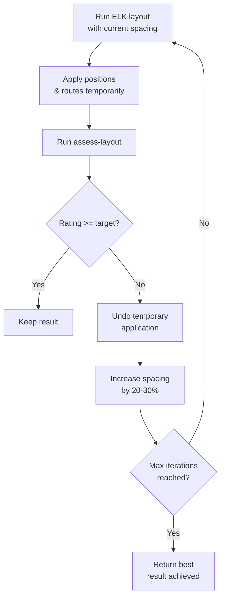

# Layout Engine

This document describes the layout and quality assessment systems, including Zest-based algorithms, ELK Layered integration, group-aware layout, and the multi-metric quality assessment framework.

## Table of Contents

- [Layout Algorithms (Zest)](#layout-algorithms-zest)
- [ELK Layered Algorithm](#elk-layered-algorithm)
- [Layout Presets](#layout-presets)
- [Flat View Layout](#flat-view-layout)
- [Group-Aware Layout](#group-aware-layout)
- [Hub Element Detection](#hub-element-detection)
- [Element Auto-Sizing](#element-auto-sizing)
- [Layout Quality Assessment](#layout-quality-assessment)
- [Auto-Layout-and-Route with Target Rating](#auto-layout-and-route-with-target-rating)
- [View Spacing Adjustment](#view-spacing-adjustment)
- [Configuration Constants](#configuration-constants)

## Layout Algorithms (Zest)

The `LayoutEngine` computes element positions using Eclipse Zest graph layout algorithms. It produces **positions only** (no connection routing).

### Supported Algorithms

| Algorithm | Description | Best For |
|-----------|-------------|----------|
| `tree` | Top-down hierarchical tree (in the family of [15]) | Hierarchical relationships |
| `spring` | Force-directed/spring-based (in the family of [13], [14]) | Organic clustering |
| `directed` | Sugiyama-style layered hierarchy [7] | Complex directed graphs |
| `radial` | Concentric circles | Hub/network views |
| `grid` | Regular grid arrangement | Information-dense layouts |
| `horizontal-tree` | Left-to-right tree (in the family of [15]) | Horizontal hierarchies |

The `radial` and `grid` presets are empirical project heuristics with no specific academic provenance. See [bibliography.md](bibliography.md) for the cited references and a confidence note on the Zest preset family attributions.

### Computation Pipeline

1. Resolve spacing from options (default: 50px)
2. Instantiate Zest algorithm with `NO_LAYOUT_NODE_RESIZING` style
3. Build `SimpleNode`/`SimpleRelationship` graph from layout nodes and edges
4. Compute canvas dimensions: `ceil(sqrt(nodeCount)) * (avgDimension + spacing) + 2 * padding`
5. Run `algorithm.applyLayout()` with computed canvas bounds
6. Extract positions from Zest entities (round to integers)
7. Post-layout overlap resolution via `OverlapResolver`

### Post-Layout Overlap Resolution

After Zest completes, the `OverlapResolver` eliminates sibling overlaps:

- Group elements by `parentId` (separate resolution per sibling group)
- For each group, iterate up to 10 times:
  1. Horizontal pass: sort by x, push right elements to maintain spacing gap
  2. Vertical pass: sort by y, push down elements to maintain spacing gap
  3. If zero overlaps remain, stop
- Elements in different sibling groups are never compared

**Source:** `model/LayoutEngine.java`

## ELK Layered Algorithm

The `ElkLayoutEngine` uses the ELK (Eclipse Layout Kernel) Layered algorithm [10], a production-quality Sugiyama-style hierarchical layout [7] that computes **both positions and connection routes** in a single operation. ELK Layered uses Brandes–Köpf horizontal coordinate assignment [11] internally; the project consumes ELK output rather than calling the algorithm directly.

### Key Characteristics

- Orthogonal routing (right-angle segments)
- Configurable direction: DOWN, RIGHT, UP, LEFT
- Native hierarchical element support (children stay inside parents)
- Combined layout + routing in one pass

### Spacing Configuration

| Parameter | Value |
|-----------|-------|
| Node-to-node | `effectiveSpacing` (default 50px) |
| Edge-to-node | `effectiveSpacing / 2` |
| Between layers | `effectiveSpacing` |
| Component-to-component | `effectiveSpacing` |

### Group Padding

Scales with spacing to accommodate Archi's group labels (~24px rendered at group top):

```text
topPad  = max(25, 24 + effectiveSpacing * 0.3)
sidePad = max(12, effectiveSpacing * 0.25)
```

### Hierarchical Construction (Two-Pass)

**First pass:** Create top-level ELK nodes. Pre-configure parent nodes that have children:
- Set `NODE_SIZE_CONSTRAINTS = MINIMUM_SIZE`
- Enable subgraph layout
- Assign group padding

**Second pass:** Create child nodes inside their parents. Orphaned children (parent not found) are promoted to top-level.

### Edge Containment

Edges are placed in the **lowest common ancestor** of their source and target nodes. The engine walks ancestor chains from both ends until they meet.

### Routing Output

Only **intermediate bendpoints** are extracted from ELK output. Start/end attachment points are omitted because Archi's ChopboxAnchor computes perimeter intersections automatically at render time.

**Source:** `model/ElkLayoutEngine.java`

## Layout Presets

Semantic mappings from preset names to algorithm + default spacing:

| Preset | Algorithm | Spacing | Use Case |
|--------|-----------|---------|----------|
| `compact` | grid | 20px | Tight grid for information density |
| `spacious` | tree | 80px | Generous spacing for readability |
| `hierarchical` | tree | 50px | Top-down tree reflecting relationships |
| `organic` | spring | 50px | Force-directed for related elements |

**Source:** `model/LayoutPreset.java`

## Flat View Layout

The `layout-flat-view` tool positions all top-level elements and groups on a view using row, column, or grid arrangements. It eliminates manual x/y coordinate calculation for flat (non-grouped) views.

### Parameters

| Parameter | Default | Description |
|-----------|---------|-------------|
| `viewId` | required | View to layout |
| `arrangement` | required | `"row"`, `"column"`, or `"grid"` |
| `spacing` | 40 | Gap between elements (px) — same default as `layout-within-group` (40px) |
| `padding` | 20 | Space from view origin (px) |
| `sortBy` | *(none)* | Sort elements before positioning: `"name"`, `"type"`, or `"layer"` |
| `categoryField` | *(none)* | Group elements into visual sections: `"type"` or `"layer"` — inserts 2x spacing between sections |
| `columns` | *(auto)* | Column count for grid mode — auto-detected via `ceil(sqrt(n))` if omitted |

### Behavior

- Positions all top-level elements and groups (not elements inside groups)
- Respects heterogeneous element sizes (elements with embedded children treated as larger boxes)
- Does NOT route connections — run `auto-route-connections` after
- Full command stack integration (undo/redo, batch mode, approval mode)

### When to Use

| Tool | Use Case |
|------|----------|
| `layout-flat-view` | Flat views with no groups — automatic positioning with sorting/categorization |
| `layout-within-group` | Position children inside a specific group container |
| `compute-layout` | Graph-aware layout using Zest algorithms (tree, spring, directed, etc.) |
| `auto-layout-and-route` | Combined ELK layout + routing in one operation |

**Source:** `model/ArchiModelAccessorImpl.java`, `handlers/ViewPlacementHandler.java`

## Group-Aware Layout

### layout-within-group

Arranges children within a single group container.

**Parameters:**

| Parameter | Default | Description |
|-----------|---------|-------------|
| `arrangement` | required | `"row"`, `"column"`, or `"grid"` |
| `spacing` | 40 | Gap between children (px) |
| `padding` | 10 | Space from group edges (px) |
| `columns` | *(auto)* | Column count for grid mode |
| `elementWidth` | *(original)* | Uniform child width |
| `elementHeight` | *(original)* | Uniform child height |
| `autoWidth` | false | Compute width from label text length |
| `autoResize` | false | Resize group to fit children |
| `recursive` | false | Propagate sizing upward through ancestors |

**Behavior:** Positions direct children only (not recursive into sub-groups). Parent group size changes only if `autoResize=true`. With `recursive=true` and `autoResize=true`, ancestor groups resize to fit.

### arrange-groups

Positions top-level groups relative to each other.

**Parameters:**

| Parameter | Default | Description |
|-----------|---------|-------------|
| `arrangement` | required | `"grid"`, `"row"`, or `"column"` |
| `spacing` | 40 | Gap between groups (px) |
| `columns` | *(auto)* | Column count for grid mode |
| `groupIds` | *(all)* | Specific groups to arrange; null = all |

Groups not in `groupIds` remain at their current positions.

### optimize-group-order

Reorders elements within groups to minimize inter-group edge crossings using the barycentric heuristic [7].

**Algorithm:**

1. Build inter-group edges from assessment connections
2. For up to 10 iterations:
   - For each group: compute barycenter for each element (average position index of connected elements in other groups)
   - Sort elements by barycenter (unconnected elements sorted to end)
   - Evaluate crossing count, keep ordering if improved
   - If converged, stop
3. Re-layout each group with the new ordering
4. Resize groups to fit children

**Crossing count:** Straight-line segment intersection test between inter-group edge segments. O(n^2) pairwise comparison.

### Grouped View Assembly Workflow

```text
1. Create groups           → add-group-to-view
2. Add elements to groups  → add-to-view with parentViewObjectId
3. Internal layout         → layout-within-group (per group)
4. Group arrangement       → arrange-groups
5. Connect elements        → auto-connect-view (showLabel: false for cleaner routing)
6. Crossing optimization   → optimize-group-order → arrange-groups
7. Resize hub elements     → detect-hub-elements → update-view-object
8. Route connections       → auto-route-connections (autoNudge: true for automatic fixing)
9. Assess quality          → assess-layout → iterate if needed
```

### Flat View Assembly Workflow

```text
1. Add elements            → add-to-view (positions don't matter)
2. Automatic layout        → layout-flat-view (row/column/grid, optional sortBy/categoryField)
3. Connect elements        → auto-connect-view
4. Route connections       → auto-route-connections (autoNudge: true)
5. Assess quality          → assess-layout → iterate if needed
```

## Hub Element Detection

The `detect-hub-elements` tool identifies high-connectivity elements on a view — elements that act as hubs in hub-and-spoke topologies (e.g., API gateways, ESBs, shared databases). These hubs cause **port congestion** where many connections compete for attachment points on a small perimeter, producing bundled overlapping paths.

### Canonical Hub Thresholds

The codebase carries four distinct connection-count thresholds with different roles. They are **not interchangeable**:

| Threshold | Constant / Source | Role |
|-----------|-------------------|------|
| ≥ 5 connections | `LayoutQualityAssessor.HUB_DETECTION_THRESHOLD` (public canonical) | Hub *candidate* signal for the LLM ("this element is worth examining") |
| > 6 connections | `LayoutQualityAssessor.HUB_DETECTION_THRESHOLD + 1` (the `detect-hub-elements` 1D-suggestion-emit gate) — derived from the candidacy threshold; the formula's growth term `15 × (count − 6)` is non-positive at exactly 5, so suggestions only emit one above candidacy. Note: `EdgeAttachmentCalculator.HUB_FACE_REDISTRIBUTION_THRESHOLD = 6` shares this value but is a separate Phase-1.1 routing-internal redistribution gate, NOT the suggestion-emit threshold. | *1D sizing-suggestion* trigger — `detect-hub-elements` emits resize suggestions for the perimeter perpendicular to the connection flow |
| > 12 connections | `LayoutQualityAssessor.HUB_2D_RESIZE_THRESHOLD` | *2D sizing-suggestion* trigger — for very high-fan-out hubs, `detect-hub-elements` additionally surfaces a 2D-resize suggestion (`width += 15 × ⌈excess/2⌉`, `height += 15 × ⌊excess/2⌋`) so connections can spread across all four faces |
| ≥ 4 connections per face | `LayoutQualityAssessor.M5_FACE_GUARD_MIN_CONNECTIONS` | M5 *hub-port-quality* face-count guard — a separate per-face metric, not a hub-detection threshold |

For a deeper LLM-agent walkthrough of when each threshold applies, when to use `detect-hub-elements` vs `resize-elements-to-fit`, and the gaps to be aware of, see [Hub Identification and Sizing Advisory](../_bmad-output/implementation-artifacts/hub-identification-and-sizing-advisory-2026-05-03.md).

### Connection Counting

The tool traverses all visual elements and connections on a view, counting connections per `viewObjectId`:

```text
For each archimate connection on the view:
  connectionCounts[sourceViewObjectId] += 1
  connectionCounts[targetViewObjectId] += 1
```

A connection between A and B increments both counts. An element that is source of 3 connections and target of 4 has `connectionCount = 7`. Counts are per visual instance (`viewObjectId`), not per model element — the same element appearing multiple times on a view has independent counts per instance.

Elements with zero connections are excluded from the result.

### Hub Sizing Suggestions

Elements exceeding the hub threshold (>6 connections) receive sizing suggestions based on the hub element formula. The Kandinsky orthogonal-layout model [8] is the relevant background reference for treating high-degree vertices specially; the formula itself is empirical (project contribution, not paper-derived):

**1D suggestion (>6 connections):**

```text
suggestedDimension = baseDimension + 15px × (connectionCount - 6)
```

Suggestions are flow-direction-aware:

- **Horizontal layouts** (left-to-right groups): increase **height** for more vertical perimeter
- **Vertical layouts** (top-to-bottom groups): increase **width** for more horizontal perimeter
- **True hubs** (connections from all directions): increase **both**

**2D suggestion (>12 connections, additional):**

```text
width  += 15 × ⌈(connectionCount - 12) / 2⌉
height += 15 × ⌊(connectionCount - 12) / 2⌋
```

Surfaced alongside the 1D pair so the calling agent can pick 2D inflation when the connection fan-out warrants distributing ports across all four edges (~N/4 connections per edge). The 2D formula keeps the resize aspect-ratio-neutral by splitting the growth term between width and height.

### Response Structure

```json
{
  "result": {
    "viewId": "abc-123",
    "totalElements": 15,
    "totalConnections": 22,
    "averageConnectionCount": 3.1,
    "elements": [
      {
        "viewObjectId": "vo-1", "elementId": "el-1",
        "elementName": "API Gateway", "elementType": "ApplicationComponent",
        "connectionCount": 12, "width": 120, "height": 55
      }
    ],
    "suggestions": [
      "Element 'API Gateway' has 12 connections (hub threshold: 6). Consider increasing height to 145px (55 + 15 × 6) for horizontal layouts, or width to 210px (120 + 15 × 6) for vertical layouts."
    ]
  },
  "nextSteps": ["Use update-view-object to resize hub elements..."]
}
```

### Workflow Position

Hub detection slots between group optimization and connection routing:

```text
... → optimize-group-order → arrange-groups
    → detect-hub-elements → update-view-object (resize hubs)
    → auto-route-connections → assess-layout
```

**Source:** `model/ArchiModelAccessorImpl.java`, `handlers/ViewPlacementHandler.java`

## Element Auto-Sizing

Elements placed at the default size (120x55) may truncate long names. Two mechanisms ensure labels are fully visible.

### Auto-Size at Placement (`autoSize` on `add-to-view`)

When `autoSize: true` is passed to `add-to-view`, the server computes element dimensions from the label text using SWT font metrics before the element is placed on the view.

**Algorithm:**

1. Measure label text width and height using `GC.textExtent()` on the SWT UI thread
2. Add horizontal padding (20px) and vertical padding (10px)
3. Apply aspect-ratio-aware sizing with target ratio 1.5:1 (acceptable range [1.2:1, 2.5:1])
4. If the computed width exceeds target ratio, increase height to bring the ratio within range
5. Short names (≤15 characters) keep the default 120x55 — auto-sizing only activates for longer names
6. Explicit `width`/`height` parameters take precedence over `autoSize`

This is the recommended approach for flat views — it eliminates the need for a post-placement resize pass.

### Resize Elements to Fit (`resize-elements-to-fit`)

The `resize-elements-to-fit` tool resizes all (or selected) elements on an existing view to fit their labels. It handles nested containment with a two-pass algorithm:

**Algorithm:**

1. **Child pass:** Identify all elements with children. Process leaf elements first — compute dimensions from label text using SWT font metrics with the same aspect-ratio-aware algorithm as `autoSize`
2. **Parent pass:** For each parent element, compute the bounding box of all children, add padding (horizontal: 20px) plus a **dynamic containment label height** computed per parent from font metrics and word-wrap simulation, and set the parent's dimensions to contain both its own label and all children
3. **Child shift:** When the parent's wrapped label height exceeds the previously assumed top margin, children are shifted down so they clear the multi-line label rather than being obscured by its lower lines
4. **Parent height never shrinks** — only grows to accommodate the wrapped label and its children
5. Apply all size changes as a single compound command (atomic undo)

The dynamic label height (B50) replaces the previous fixed `CONTAINMENT_LABEL_TOP = 25` constant. Long parent labels that wrap across two or three lines now correctly reserve vertical space for every line, eliminating the failure mode where a multi-line parent label visually obscured its first child.

**Parameters:**

| Parameter | Default | Description |
|-----------|---------|-------------|
| `viewId` | required | View to resize elements on |
| `elementIds` | *(all)* | Specific elements to resize; null = all elements on the view |

### When to Use Which

| Scenario | Approach |
|----------|----------|
| Placing elements on flat view | `add-to-view` with `autoSize: true` |
| Bulk-creating elements | `bulk-mutate` with `autoSize: true` per `add-to-view` operation |
| Elements inside groups | `layout-within-group` with `autoWidth: true` (existing feature) |
| Existing view with truncated labels | `resize-elements-to-fit` on the view |

**Source:** `model/ArchiModelAccessorImpl.java`, `handlers/ViewPlacementHandler.java`

## Layout Quality Assessment

The `LayoutQualityAssessor` computes multi-dimensional layout quality metrics. All coordinates are in absolute canvas space. This is a pure-geometry class with no EMF dependencies.

### Metric Categories

The assessor evaluates 8 metric categories, each producing an individual rating.

#### Element Overlaps

| Type | Definition | Impact |
|------|------------|--------|
| Sibling overlaps | Same-parent elements with AABB intersection | Primary metric — penalized |
| Containment overlaps | Parent-child / ancestor-descendant | Excluded (intentional nesting) |
| Note overlaps | Note-to-element overlaps | Informational only |

**Rating:** 0 = "pass", 1-3 = "fair", 4+ = "poor"

#### Edge Crossings

```text
crossing_ratio = edgeCrossingCount / connectionCount
```

| Condition | Rating |
|-----------|--------|
| crossings < 5 | "pass" |
| 5-20 crossings | "good" |
| crossings >= 20, ratio <= 1.5 | "good" |
| ratio <= 4.0 | "fair" |
| crossings < 30 | "fair" |
| crossings >= 30 | "poor" |

**Grouped view leniency:** If a view has groups and overlaps == 0, passThroughs <= 3, labelOverlaps == 0, alignment > 30, and spacing > 15.0, crossing ratings get a one-tier boost ("poor" to "fair", "fair" to "good"). This acknowledges that cross-group edge crossings are topologically unavoidable.

#### Element Spacing

Average minimum gap between sibling elements:

```text
avgSpacing = mean(minGap(A, B)) for all sibling pairs
```

**Rating:** > 30px = "pass", > 15px = "good", <= 15px = "fair"

#### Alignment Score

Measures edge alignment of leaf (non-group) elements along left edges, centers, top edges, and vertical centers (5px tolerance):

```text
alignment = (aligned_pair_count / max_possible_pairs) * 100
```

**Rating:** > 60 = "pass", > 30 = "good", <= 30 = "fair"

#### Label Overlaps

Estimates label bounding boxes from text length and path position. Uses 10px inset on both label and element rectangles to absorb estimation error. Also detects near-miss proximity within 5px.

**Rating:** 0 = "pass", > 0 = "fair"

#### Pass-Throughs

Detects connections that cross through element rectangles. Clips connection paths from element centers to perimeter (using Archi's OrthogonalAnchor model) and tests segment-vs-rectangle intersection using the Liang–Barsky line-clipping algorithm [16]. Excludes ancestors, descendants, and groups (transparent containers). Uses 10px inset to absorb corner-arc imprecision.

Also detects **self-element pass-throughs** — cases where non-terminal segments of a connection's route pass through the connection's own source or target element body (using 5px inset). This catches routes that enter endpoint elements through interior points rather than approaching cleanly from an edge.

**Rating:** counted from cross-element pass-throughs only — 0 = "pass", 1-3 = "fair", 4+ = "poor". Self-element pass-throughs are reported in the assessment output (informational) but **excluded from rating** (B54). Self-element geometry frequently cannot be resolved by re-routing alone, and penalising it masks the structural quality of cross-element routing.

#### Coincident Segments

Counts connection segments from different connections that share identical coordinates (within tolerance) and have overlapping parallel ranges.

**Rating:** 0 = "pass", 1-3 = "good", 4-8 = "fair", 9+ = "poor"

#### Non-Orthogonal Terminals

Counts connections whose terminal segments (first two or last two points) form diagonal rather than perpendicular approaches to elements. Checked per-connection (not per-segment).

**Rating:** 0 = "pass", 1-3 = "fair", 4+ = "poor"

### Assessor Redesign

The assessor redesign introduces five perception-aligned metrics (M1 corrected, M2–M5 new), a corridor-utilisation metric (R8), an informational narrow-corridor signal (`parallelConnectionGap_V_p10`), and a two-dimensional overall rating (M6) that decouples layout quality from routing quality. The redesign was driven by ArchiMate manual-routed reference calibration and visual-severity owner sign-off that pre-redesign metrics misaligned with user perception.

| Metric | Field | Definition |
|--------|-------|------------|
| **M1** (corrected) | `nonOrthogonalTerminalCount` | Visible-segment-length guard. Pre-redesign, the metric over-reported clipped diagonals — bendpoints inside the source/target element bounds were counted as if visible. The corrected M1 ignores Archi-clipped diagonals (post-clip visible segment only) and was calibrated against the V4 manual oracle (manual = 21). |
| **M2** | `interiorTerminatingCount` | Connections whose terminal bendpoint lands inside the source or target element bounds. Routing Tier 1R. Previously unmeasured. |
| **M3** | `zigzagCount` | Reversal patterns where two consecutive segments meet at a shared axis (zigzag triple). Routing Tier 1R. Previously unmeasured. M3 **skips connections already classified as pass-throughs** by `detectPassThroughs` (classification-precedence guard at `LayoutQualityAssessor.countZigzags()`): for the failed-detour-around-element pattern the visually-correct label is passthrough-only — the small reversal is a consequence of the failed detour, not an independent defect. Pinned by `RoutingClassificationPrecedenceTest`. |
| **M4** | `connectionEdgeCoincidenceCount` | Connection segments running parallel to and within `EDGE_COINCIDENCE_TOLERANCE_PX` (3px) of a foreign element's edge line. Routing Tier 1R with thresholds `EDGE_COINCIDENCE_GOOD_MAX = 2` and `EDGE_COINCIDENCE_FAIR_MAX = 5`. Pre-redesign only conn-vs-conn coincidence was measured (B45 self-exclusion). The self-exclusion guard removal makes M4 always flag parallel-coincident segments. **v1.3 oracle baseline corrected to M4 = 12** (previously documented as 2 — the discrepancy was a measurement artefact, not a routing change). **Topology-bound floor caveat:** on hub-and-spoke layouts at hub-port-quality-fixed hub sizes, M4 has a structural floor that does not respond to spacing inflation. M4 above the floor reflects routable congestion; M4 at the floor reflects topology. |
| **M5** | `hubPortQualityScore`, `hubPortQualityFaces` | View-aggregate mean of per-hub-face distinct-slot ratios for any element face with ≥ 4 connections. Catastrophic example pre-redesign: 1 face slot for 7 connections (HPQ 0.18). v1.3 oracle HPQ measured 0.18 (catastrophic, invisible to old assessor); current pipeline preserves 0.77 — roughly five times better. Thresholds: `pass` ≥ 0.95, `good` ≥ 0.75, `fair` ≥ 0.5, `poor` < 0.5. |
| **R8** | `corridorUtilisation`, `corridorUtilisationDetails` | Wide-corridor utilisation — measures how well wide corridors carry connections in proportion to their width. Pinned ≥ 0.25 on the V4 oracle by `V4OracleCorridorUtilisationRegressionTest`. |
| **`parallelConnectionGap_V_p10`** | `vAxisParallelGapP10`, `vAxisParallelGapNarrow25Count`, `parallelConnectionGapDetail` | Informational narrow-corridor signal. The primary value is the 10th-percentile pairwise parallel gap on the V axis (in pixels); the ArchiMate manual-routed reference anchors at 13.30 ± 0.5. The secondary `vAxisParallelGapNarrow25Count` counts V-axis segments below 25 px gap (more = worse). Calibration validated against an ordered reference set of four views (gold > hub-heavy-source > standard-source > narrow-corridor regime — monotonic by owner perception). **Currently no rating impact** — surfaces the structural narrow-corridor floor so an LLM agent can recognise when convenience spacing tools cannot mitigate further. Full per-axis detail (mean / min / p10 / narrowGapCount@{15,25,40} for V and H axes) returned in `parallelConnectionGapDetail` when `includeViolatorIds: true`. Pinned by `ParallelConnectionGapMetricTest`. |

#### Rating Re-Anchors

Two cut-points were re-anchored to align with the visual-severity hierarchy:

- **`overlapCount` → binary `>0 → poor`** (Tier 1L). Any sibling overlap caps the layout tier at `poor`. Previously rated `fair / poor` with a count-based cut-point that under-rated views with isolated overlaps. Aligns with the user's perceptual gate that any visible overlap reads as a broken layout.
- **`parentLabelObscuredCount` → Tier 1L binary `>0 → poor`** (promoted from informational). When a parent element's label is obscured by a child, the diagram fails its primary purpose — reading the element's name. Promoted into the layout-tier rating via M6.

#### M6 — Two-Dimensional Overall Rating

M6 replaces B38's single-tier overall rating with two independently computed tier indices: a **layout tier** (driven by element-level metrics) and a **routing tier** (driven by connection-level metrics including M2/M3/M4 routing-tier promotions and M5 hub-port quality). The overall rating is the worse of the two:

```text
overallRating = levelToRating(max(layoutLevel, routingLevel))
```

This decouples layout quality from routing quality so a poor-routing fix does not drag a strong-layout view's tier and vice versa. `parentLabelObscuredCount` and `labelTruncationCount` (B53 informational detections) are promoted into the layout tier under M6.

### JUnit-Protected Release-Gate Metrics

Every quality threshold introduced by the assessor redesign ships with a JUnit regression test pinning the metric on the ArchiMate manual-routed reference oracle. This codifies the project convention that every routing or layout improvement ships with a test pinning the new threshold — wins were lost repeatedly in prior cycles because nothing protected them.

| Bound | Threshold | Test |
|------|-----------|------|
| `hubPortQualityScore` (M5) | ≥ 0.70 | `V4OracleQualityRegressionTest` |
| `coincidentSegmentCount` (legacy parallel-coincident metric) | ≤ 3 | `V4OracleQualityRegressionTest` |
| `nonOrthogonalTerminalCount` (M1) | ≤ 5 | `V4OracleQualityRegressionTest` |
| `corridorUtilisationScore` (R8) | ≥ 0.25 | `V4OracleCorridorUtilisationRegressionTest` |
| `vAxisParallelGapP10` (`parallelConnectionGap_V_p10`) | ≥ 13.30 ± 0.5 | `ParallelConnectionGapMetricTest` |
| Zigzag↔passthrough classification precedence | Failed-detour fixture: zigzag count after guard = 0 | `RoutingClassificationPrecedenceTest` |
| Post-autoNudge parent-group bounds | All children remain within parent group bounds after `auto-route-connections(autoNudge=true)` | `AutoNudgeGroupBoundsFollowupTest` (15 tests) |
| Post-spacing-tool parent-group bounds | All children remain within parent group bounds after `apply-spacing-recommendations` / `apply-element-spacing-recommendations` / `apply-group-spacing-recommendations` / `adjust-view-spacing` | `SpacingToolParentBoundsTest` (12 tests) |

A future routing or spacing change that regresses any of these thresholds fails the protected test rather than silently shipping. The middle row of `V4OracleQualityRegressionTest` is bounded by a constant the test names `M5_CEILING`; the name reflects the constant's release-gate slot, not the M5 hub-port-quality metric (which is bounded by `HPQ_FLOOR` on the first row). The bound applies to the legacy `coincidentSegmentCount` getter, not the new M4 `connectionEdgeCoincidenceCount`.

### Overall Rating (Severity-Tiered)

The overall rating uses a **three-tier severity system** instead of simple worst-metric-wins. Each tier has a cap on how much it can degrade the overall rating:

| Tier | Severity | Metrics | Cap |
|------|----------|---------|-----|
| **Tier 1** | Critical | overlaps, passThroughs, coincidentSegments | No cap — drives overall rating directly |
| **Tier 2** | Moderate | edgeCrossings | Capped at "fair" |
| **Tier 3** | Cosmetic | spacing, alignment, labelOverlaps, nonOrthogonalTerminals | Capped at "good" |

```text
Rating levels: pass/excellent = 0, good = 1, fair = 2, poor = 3

overall = max(worstTier1, min(worstTier2, 2), min(worstTier3, 1))

Map: 0 → "excellent", 1 → "good", 2 → "fair", 3+ → "poor"
```

This prevents cosmetic issues (spacing, alignment) from masking structural quality. A view with perfect structure but poor alignment still achieves "good". Conversely, overlaps or excessive pass-throughs drive the rating to "poor" regardless of cosmetic scores.

### Informational Detections (Non-Rating)

Three additional detections appear in the assessment output but do **not** affect the overall rating. They give LLM agents actionable signals to fix label and image quality without entering the severity-tiered rating system.

#### Label Truncation

Word-wrap-aware vertical overflow check. For each element, the assessor estimates how many lines the label will wrap to at the element's current width using SWT font metrics, then compares the wrapped label height against the element's height. Elements where the wrapped label would not fit vertically are flagged.

#### Parent Label Obscured by Child

Flags parent elements whose label area at the top of the element is overlapped by a child element. Notes are excluded from this detection (notes are not subject to ArchiMate containment rules).

#### Image Sibling Overlap

Flags elements that carry a custom image (`imagePath` set) and visually overlap any sibling element at the same containment level. The check uses the element's full bounds, not the image rectangle alone, since custom images extend the visible footprint.

### Violator IDs (B55)

When `includeViolatorIds: true` is passed to `assess-layout`, the response includes a `violatorIds` map returning the specific visual object IDs that violate each metric. This enables targeted per-element fixes instead of global re-layout.

| Metric | IDs Returned |
|--------|-------------|
| `overlaps` | Both element IDs from each overlapping pair |
| `passThroughs` | Connection IDs (cross-element only) |
| `coincidentSegments` | Connection IDs sharing corridor segments |
| `nonOrthogonalTerminals` | Connection IDs with diagonal source/target entry |
| `boundaryViolations` | Child element IDs extending outside parent group bounds |

**Explicitly excluded:** Crossings are treated as an emergent property best addressed by global tools (e.g. `optimize-group-order`, `auto-route-connections`), not per-connection fixes.

The complete ID set is returned for each metric (no cap), unlike descriptions which cap at 10. Empty metrics are omitted from the map. The parameter defaults to `false` for backward compatibility — existing consumers see no change.

**Source:** `model/LayoutQualityAssessor.java`, `model/routing/CoincidentSegmentDetector.java`

### Suggestion Generation

The assessor generates actionable suggestions when thresholds are exceeded:

- Overlaps > 0: suggest specific overlap pairs
- Crossings > 10: suggest routing or element reordering
- Spacing < 15px: suggest increasing spacing
- Alignment < 30: suggest alignment tools
- Boundary violations: list children extending outside parents
- Containment overlaps > 0: informational note clarifying these are expected ancestor-descendant overlaps that need no action
- Off-canvas elements: warn about negative or extreme coordinates

### Assessment Result Structure

```json
{
  "overlapCount": 0,
  "edgeCrossingCount": 12,
  "averageSpacing": 35.2,
  "alignmentScore": 45,
  "labelOverlapCount": 1,
  "passThroughCount": 0,
  "coincidentSegmentCount": 2,
  "nonOrthogonalTerminalCount": 1,
  "overallRating": "good",
  "ratingBreakdown": {
    "overlaps": "pass",
    "edgeCrossings": "good",
    "spacing": "pass",
    "alignment": "good",
    "labelOverlaps": "pass",
    "passThroughs": "pass",
    "coincidentSegments": "good",
    "nonOrthogonalTerminals": "fair"
  },
  "suggestions": ["..."],
  "violatorIds": {
    "coincidentSegments": ["conn-abc", "conn-def"],
    "nonOrthogonalTerminals": ["conn-xyz"]
  },
  "contentBounds": {"x": 50, "y": 50, "width": 800, "height": 600},
  "crossingsPerConnection": 1.2
}
```

The `violatorIds` field is only present when `includeViolatorIds: true` is passed. Metrics with zero violations are omitted from the map.

**Source:** `model/LayoutQualityAssessor.java`

## Auto-Layout-and-Route with Target Rating

The `auto-layout-and-route` tool supports two layout modes and optional quality iteration.

### Mode: `auto` (default) — ELK Layered

Uses the ELK Layered algorithm to compute both element positions and connection routes in a single operation. Best for flat views or when no specific structural intent is needed.

### Mode: `grouped` — Orchestrated Grouped Workflow

Orchestrates the full Branch 2 grouped-view workflow in a single atomic tool call:

1. `layout-within-group` for each group (sizes groups to fit contents)
2. `arrange-groups` with topology arrangement (orders groups by connection density)
3. `optimize-group-order` (minimises inter-group edge crossings)
4. `auto-route-connections` (obstacle-aware orthogonal routing)

This replaces the manual 5-7 step grouped workflow with a single call. Requires the view to have groups with children. Produces obstacle-aware orthogonal routing between groups — best choice for views with ArchiMate groups (layered architecture, producer-consumer flows, etc.).

#### Intra-Group Arrangement Heuristic

`computeGroupedLayoutPass()` and `computeOptimizeGroupOrderPass()` choose the intra-group arrangement based on element count and the layout's flow direction:

| Flow Direction | Element Count | Arrangement |
|---|---|---|
| Vertical (DOWN, UP) | 1–3 | row |
| Vertical (DOWN, UP) | 4+ | grid |
| Horizontal (RIGHT, LEFT) | any | column |

This replaces the previous hardcoded column arrangement that produced very tall narrow groups (e.g. 1:12 aspect ratio strips) on vertical-flow views. The heuristic keeps groups roughly square on vertical-flow layouts while preserving the column orientation that horizontal-flow layouts need.

### Without targetRating

Run layout once (ELK in `auto` mode, or the orchestrated workflow in `grouped` mode), apply positions and routes, return result.

### With targetRating

Multi-iteration quality loop (max 5 attempts). The v1.4 **smart iteration strategy** (B62) replaces the earlier monotonic spacing-bump loop with a factor-aware iteration over four orthogonal levers: spacing, corridor diversity (`occupancyWeight` bumped up to 4× the default), reverse-sweep crossing minimisation (`CrossingMinimizer.reverseSweep = true`), and a tier-weighted score with a Tier-1 veto. Plateau detection short-circuits once successive iterations stop improving. Iteration helpers consume the M6 layout-tier × routing-tier model so a stuck factor in one dimension can still unlock progress in the other.

```text
B62-1: factor-aware iteration loop (spacing, occupancy, sweep, score)
B62-2: parameterized corridor diversity (occupancyWeight scaling)
B62-3: reverse-sweep crossing minimizer
B62-4: tier-weighted score + Tier-1 veto (consumes M6 tiers)
B62-5: factor-aware plateau detection
B62-6: end-to-end validation
```



### Router Mode Switch

ELK generates orthogonal bendpoints. The view's connection router is automatically switched to manual/bendpoint mode so ELK paths render correctly.

### Limitation

ELK does not see elements inside groups as obstacles for inter-group connections. Inter-group edges may clip through internal elements. Workaround: follow ELK with `auto-route-connections` for element-aware obstacle routing.

## View Spacing Adjustment

The `adjust-view-spacing` tool (B68, v1.4) inflates the inter-element and inter-group spacing on an existing view and re-routes connections in a single atomic operation. It is the targeted alternative to re-running ELK from scratch when an existing arrangement only needs more breathing room.

### When to Use

| Scenario | Tool |
|----------|------|
| View needs more breathing room without changing element positions or group order | `adjust-view-spacing` |
| Apply density heuristic to within-group element spacing in one call | `apply-element-spacing-recommendations` |
| Apply density heuristic to inter-group corridor spacing in one call | `apply-group-spacing-recommendations` |
| Apply both heuristics in one call with the inflation-knee guard | `apply-spacing-recommendations(scope=both)` |
| View needs full re-layout from scratch | `auto-layout-and-route` (mode `auto` or `grouped`) |
| Specific elements need resizing for label fit | `resize-elements-to-fit` |
| Hub elements need port-fanout sizing | `detect-hub-elements` → `update-view-object` |

### Behavior

- Scales current element positions outward by a uniform factor while preserving relative ordering and parent-child containment.
- Resizes parent groups to accommodate the new child positions.
- Runs `auto-route-connections` after the spacing adjustment so connections re-route through the larger corridors.
- Runs a post-pass overflow-detection check that catches any child element whose new position pushes it outside its parent group's bounds and resizes the parent. The pass shares an extracted `childExceedsParentBounds` predicate and `resizeParentGroupIfNeeded` helper with the `auto-route-connections` autoNudge path so the rule is computed in exactly one place. Pinned by `SpacingToolParentBoundsTest`.
- All mutations bundled in a single compound command (atomic undo).

### Density-Aware Default (v1.4)

When `interElementDelta` is omitted on a view that already has a problematic spacing-related metric (`coincidentSegmentCount > 2` OR `connectionEdgeCoincidenceCount > 4`), `adjust-view-spacing` derives a heuristic-driven default from the view's connection count instead of using 0:

| Total connections on view | Target element spacing |
|---|---|
| ≤ 15 | 60 px |
| 16–30 | 80 px |
| > 30 | 100 px |

Pass `interElementDelta: 0` explicitly to suppress default-resolution. The response DTO's `defaultResolutionReason` field reports whether the tool resolved a default and which trigger metric and tier it used.

The same heuristic table is the source-of-truth for `apply-element-spacing-recommendations` (see below) and is published to LLM agents via `archimate://reference/archimate-view-patterns` Pre-Layout Planning §2.

### Convenience Tools (Routing Preconditions)

Three convenience tools bundle "read view's current geometry → consult heuristics table → call `adjust-view-spacing` with the computed delta" into a single transactional call. They expose the same heuristic the density-aware default uses, but with explicit opt-in semantics, a `dryRun` preview mode, and before/after `assess-layout` snapshots in one envelope.

| Tool | Inflates | Knee guard | Heuristic source-of-truth |
|---|---|---|---|
| `apply-element-spacing-recommendations` | `interElementDelta` (within-group element spacing) | No | `archimate://reference/archimate-view-patterns` Pre-Layout Planning §2, intra-group tiers |
| `apply-group-spacing-recommendations` | `interGroupDelta` (inter-group corridor widening) | No | `archimate://reference/archimate-view-patterns` Pre-Layout Planning §2, inter-group tiers |
| `apply-spacing-recommendations` (composed) | Both, selected via `scope: "both" / "element" / "group"` | **Yes** — per-iteration step caps of +80 px (element) / +100 px (inter-group) inside each loop | Same source-of-truth, both tiers |

All three tools:

- Compute `delta = max(0, target - current)` from the heuristic so they never shrink existing spacing.
- Use the MIN current spacing across the view (most-tight wins) so a single tight pair triggers inflation.
- Select the hub-aware tier (element: 80/100/120 px; inter-group connected: 100/140/160 px) automatically when `detect-hub-elements` reports one or more hub candidates on the view. The hub-aware tier accounts for the corridor space formula-resized hubs consume — without it, the heuristic UNDERSHOOTS post-hub-resize and coincident-segment residuals persist.
- Return the before/after `assess-layout` snapshot in one envelope so the visual-quality impact is visible immediately.
- Are no-ops when the view has no connections (or no inter-group connections, for the group sibling).
- Combine with hub sizing (`detect-hub-elements` + `update-view-object`) to form the routing-preconditions triad. The triad is the canonical pre-routing setup for non-trivial views — see `archimate://prompts/routing-preconditions-checklist`.

The composed tool's inflation-knee guard prevents the **cumulative-inflation-past-the-knee** failure mode — spacing pushed past the narrow-corridor structural floor, which introduces zigzags and pass-throughs faster than it removes residual defects. When a per-iteration step cap fires, the response surfaces `elementKneeClampApplied` / `groupKneeClampApplied = true` plus the proposed-vs-clamped delta values. All three convenience tools run the control loop described next; the composed tool additionally enforces the per-iteration step caps.

### Embedded Control Loop and Density-Aware Termination

The three convenience tools do not apply one spacing delta and return. Each embeds an **observe → decide → density-aware-terminate** control loop (`SpacingControlLoop`; the composed tool drives two arms in sequence via `ComposerSpeculativeReplay`). The caller makes one tool call; the loop iterates internally and reports what it did.

Per iteration the loop:

1. Takes a spacing step — a `+10 px`-per-step monotone ladder while the view is improving; a larger step when escalating.
2. Applies the step and re-runs `auto-route-connections` + `assess-layout`.
3. Classifies the result on a 2×2 of *aggregate-quality trend* × *spacing-regime position*:

| Aggregate trend | Below the prescribed ~100–124 px / fan-out-sized-hub regime | Already at/above the prescribed regime |
|---|---|---|
| Still climbing | **CONTINUE** (monotone step) | **CONTINUE** (monotone step) |
| Stalled | **ESCALATE** — large steps toward the ~112 px mid-band plus a one-shot hub-resize | **PASS-HONEST** — more spacing cannot help; stop |

A degrading step is always reverted, so the loop never presents a silently-degraded view. All accepted iterations from a single call wrap in one `NonNotifyingCompoundCommand`, so one tool call is always one undo-stack entry. The loop's objective is the aggregate `thresholds_met` scalar only — per-metric monotonicity is deliberately not used because it spuriously stops on net-positive mutations. `iterationBudget` defaults to 5 (single-arm) / 8 (composed, split across arms), caller-tunable in `[1, 20]`.

The response DTO reports `terminationReason` (exactly one of eight branches), `iterationCount`, and `appliedDeltas[]` (per arm for the composed tool):

| `terminationReason` | Meaning |
|---|---|
| `goal_reached_at_iteration_N` | Target quality envelope met. |
| `budget_exhausted_after_N_iterations` | `iterationBudget` cap hit; last accepted step commits. |
| `aggregate_threshold_regressed_at_iteration_N_reverted_to_iteration_M` | Back-off fired; reverted to the best non-degraded state. |
| `structural_no_change_<reason>` | Nothing to inflate (no groups / no groups with 2+ children / no connections). |
| `heuristic_already_met_no_change` | Current spacing already ≥ target at iteration 0. |
| `dry_run_recommendation_not_applied` | `dryRun: true` short-circuit; no mutation; `iterationCount = 0`. |
| `iteration_apply_failed_at_iteration_N_reverted_after_M_accepted_iterations` | A contained mutation threw mid-application; best-effort rollback, prior accepted iterations preserved. |
| `density_floor_reflow_required` | PASS-HONEST: sound infeasibility certificate fired (see below). |

### Sound Pre-Routing Infeasibility Certificate

`SpacingPreconditionInfeasibilityCertificate` is a pure-geometry, zero-false-positive predicate evaluated from the view's measured geometry before the loop commits more spacing. It fires when the average element spacing is already in the prescribed 100–124 px band and the hub is sized for its connection count, yet aggregate quality has stalled. In that state more spacing *physically cannot* satisfy the precondition — the elements are too many for the view's area.

This is the engine's principled response to a strategic finding: the residual quality ceiling on dense hub-and-spoke views is an **infeasible-input-geometry / layout-precondition failure, not a routing-algorithm limit**. The router can refine routes; it cannot manufacture the area a dense view needs. The certificate makes that distinction explicit and tells the calling agent *which* views need structural change instead of leaving it to iterate spacing tools indefinitely.

When the certificate fires the loop:

- Stops without degrading the view (the best non-degraded state is preserved — pre-existing manual placement and pins are untouched).
- Returns `terminationReason: density_floor_reflow_required` and a `densityFloorDiagnosis` string naming the violated precondition (measured average spacing vs the 100–124 px band; hub W×H vs connection count). The composed tool returns this per arm.
- **Never auto-reflows.** A structural reflow moves user-placed elements, so the tool surfaces the reflow as an explicit user-consentable next step — *surface + offer + wait for consent, never surface + act*. The decision to discard manual placement intent belongs to the user, not the tool.

The certificate is implemented as a standalone predicate with a thin caller at each spacing-tool request-build site, sibling-symmetric with the routing-not-beneficial degraded path; the control-loop body itself is unchanged, so the certificate's soundness (zero false positives on feasible views) is the property that lets it coexist with the loop without disturbing the preserved-state guarantees. It is the authoritative stop signal; the informational `parallelConnectionGap.vAxisParallelGapP10` narrow-corridor indicator points at the same remedy class but is heuristic, not a certificate.

### Density-Aware Default in `arrange-groups`

`arrange-groups` carries a sibling-symmetric density-aware default for its `spacing` parameter. When `spacing` is omitted on a view that has inter-group connections, the tool derives a heuristic-driven default from the connection count instead of using the static 40 px:

| Total connections on view | Inter-group spacing default |
|---|---|
| ≤ 15 | 80 px |
| 16–30 | 100 px |
| > 30 | 120 px |

Pass an explicit `spacing` value (including 0 or 40) to suppress default-resolution. Applies to direct `arrange-groups` invocations only — internal compound flows that pass the static 40 default are unaffected.

**Source:** `handlers/ViewPlacementHandler.java`, `model/ArchiModelAccessorImpl.java`, `layout/SpacingControlLoop.java`, `layout/SpacingPreconditionInfeasibilityCertificate.java`, `layout/ComposerSpeculativeReplay.java`, `layout/SpacingIterationDecision.java`, `layout/SpacingIterationStep.java`, `response/dto/AdjustViewSpacingResultDto.java`, `response/dto/ApplyElementSpacingRecommendationsResultDto.java`, `response/dto/ApplyGroupSpacingRecommendationsResultDto.java`

## Configuration Constants

### LayoutEngine (Zest)

| Constant | Value |
|----------|-------|
| Default spacing | 50px |
| Canvas padding | 20px |
| Overlap resolution max iterations | 10 |

### ElkLayoutEngine

| Constant | Value |
|----------|-------|
| Default spacing | 50px |
| Top group padding | max(25, 24 + spacing * 0.3) |
| Side group padding | max(12, spacing * 0.25) |

### LayoutQualityAssessor

| Constant | Value | Purpose |
|----------|-------|---------|
| `EXCELLENT_MAX_CROSSINGS` | 5 | Crossing threshold for "pass" |
| `EXCELLENT_MIN_SPACING` | 30.0px | Spacing threshold for "pass" |
| `EXCELLENT_MIN_ALIGNMENT` | 60 | Alignment threshold for "pass" |
| `GOOD_MAX_CROSSINGS` | 20 | Crossing threshold for "good" |
| `GOOD_MIN_SPACING` | 15.0px | Spacing threshold for "good" |
| `GOOD_MIN_ALIGNMENT` | 30 | Alignment threshold for "good" |
| `GOOD_MAX_COINCIDENT` | 3 | Coincident segment threshold for "good" |
| `FAIR_MAX_OVERLAPS` | 3 | Overlap threshold for "fair" |
| `FAIR_MAX_CROSSINGS` | 30 | Crossing threshold for "fair" |
| `FAIR_MAX_COINCIDENT` | 8 | Coincident segment threshold for "fair" |
| `FAIR_MAX_PASS_THROUGHS` | 3 | Pass-through threshold for "fair" (also leniency gate) |
| `NON_ORTH_RATIO_GOOD` | 0.10 | Non-orth terminals/connections ratio for "good" |
| `NON_ORTH_RATIO_FAIR` | 0.30 | Non-orth terminals/connections ratio for "fair" |
| `CROSSING_RATIO_GOOD` | 1.5 | crossings/connections for "good" |
| `CROSSING_RATIO_MODERATE` | 4.0 | crossings/connections for "fair" |
| `ALIGNMENT_TOLERANCE` | 5.0px | Edge alignment detection tolerance |
| `LABEL_OVERLAP_INSET` | 10.0px | Label bounding box inset |
| `LABEL_PROXIMITY_THRESHOLD` | 5.0px | Near-miss detection threshold |
| `PASS_THROUGH_INSET` | 10.0px | Obstacle inset for pass-through detection |
| `SELF_ELEMENT_INSET` | 5.0px | Inset for self-element pass-through detection |

## References

[7]: bibliography.md#ref-7
[8]: bibliography.md#ref-8
[10]: bibliography.md#ref-10
[11]: bibliography.md#ref-11
[13]: bibliography.md#ref-13
[14]: bibliography.md#ref-14
[15]: bibliography.md#ref-15
[16]: bibliography.md#ref-16

Inline citations above (e.g. `[7]`) link to the entry of the same number in [bibliography.md](bibliography.md).

---

**See also:** [Routing Pipeline](routing-pipeline.md) | [Bibliography](bibliography.md) | [Coordinate Model](coordinate-model.md) | [Architecture Overview](architecture.md)
