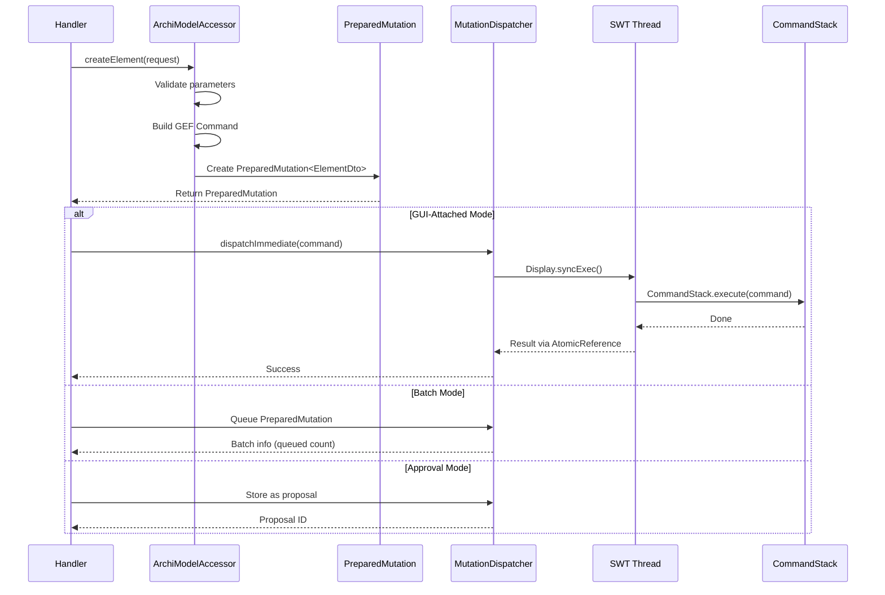
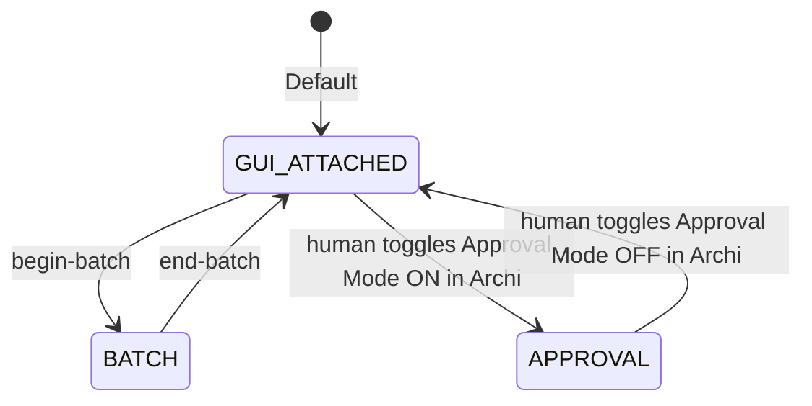

# Mutation Model

This document describes how the ArchiMate MCP Server handles model mutations, including the PreparedMutation pattern, CommandStack integration, operational modes, and the approval workflow.

## Table of Contents

- [Mutation Flow Overview](#mutation-flow-overview)
- [PreparedMutation Pattern](#preparedmutation-pattern)
- [MutationDispatcher](#mutationdispatcher)
- [Operational Modes](#operational-modes)
- [Undo and Redo](#undo-and-redo)
- [Approval Workflow](#approval-workflow)
- [Batch Mode](#batch-mode)
- [Bulk Mutate](#bulk-mutate)
- [Inline Specialization Parameter](#inline-specialization-parameter)
- [Specialization Icons](#specialization-icons)
- [Relationship Semantic Attributes](#relationship-semantic-attributes)
- [Model Metadata Mutation](#model-metadata-mutation)
- [Error Handling](#error-handling)

## Mutation Flow Overview

All model mutations follow a strict path from handler through CommandStack to the EMF model.



**Key invariant:** All mutations go through GEF `CommandStack.execute()` on the SWT UI thread. Direct EMF modification corrupts the model and breaks undo/redo.

## PreparedMutation Pattern

`PreparedMutation<T>` is an immutable record that encapsulates the complete state of a mutation before dispatch. It enables two-phase execution: prepare (validate) first, execute second.

```java
record PreparedMutation<T>(
    Command command,      // GEF Command ready for CommandStack
    T entity,             // DTO representation of the result
    String entityId,      // Unique identifier of created/updated entity
    Object rawObject      // Raw EMF object (for bulk back-references)
)
```

### Two-Phase Execution

- **Phase 1 (Preparation):** The handler calls `ArchiModelAccessor`, which validates parameters, creates the EMF object and GEF Command, and returns a `PreparedMutation<T>` — but does not execute.
- **Phase 2 (Dispatch):** The handler checks the operational mode and either dispatches immediately, queues for batch, or stores as a proposal.

### Why Two Phases

Bulk operations pre-validate **all** mutations before executing **any**. If any operation fails validation, the entire bulk operation is rejected (all-or-nothing). This prevents partial model corruption from mid-batch failures.

### Generic Type Parameter

The type parameter `<T>` constrains to the appropriate DTO type:

- `PreparedMutation<ElementDto>` for element creation
- `PreparedMutation<RelationshipDto>` for relationship creation
- `PreparedMutation<ViewDto>` for view creation
- `PreparedMutation<MutationResultDto>` for updates and deletions

**Source:** `model/PreparedMutation.java`

## MutationDispatcher

The `MutationDispatcher` is the single point where Jetty threads cross to the SWT UI thread.

### Thread Crossing

```java
dispatchImmediate(Command command) {
    Display.syncExec(() -> {
        CommandStack.execute(command);
    });
    // Result passed back via AtomicReference
}
```

### Version Tracking

`ArchiModelAccessorImpl` holds a private `AtomicLong versionCounter`; `getModelVersion()` returns its current value as a string (or `null` when no model is loaded). The value is a **monotonic change-detection token**: it *strictly increases* on every model change — agent mutations **and** human GUI edits alike — and never decreases (even an `undo` advances it, because the model did change). Consumers compare it for **equality only** ("did it change since I last looked"), which invalidates session caches, invalidates stale pagination cursors, and enables the `_meta.modelChanged` flag in responses. **Nothing consumes the delta** — only whether the value differs.

Because only equality is consumed, the *magnitude* of an increment is deliberately unspecified. A single change can advance the counter by more than one: an agent `CommandStack.execute` advances it via the inline per-method bump **and** via Archi's `PROPERTY_ECORE_EVENT` (see below), so an agent op is observed live to advance it by **+2**. This multi-bump is **benign by design** for a change-token and is long-standing (the `PROPERTY_ECORE_EVENT` lifecycle bump predates the approval work).

The increment sources are:

- **`handleModelContentChanged()`** — fires on Archi's `PROPERTY_ECORE_EVENT`, i.e. for **every** EMF notification on the active model. This is the source that covers **human GUI edits** (hand-draw, drag, rename, delete) as well as agent ops, and it is the per-op bump that fires live regardless of the inline guards.
- **Inline per-method bumps + the immediate-dispatch callback** — `versionCounter.incrementAndGet()` guards on each mutation body (and the `setOnImmediateDispatchCallback` on the approve path). These exist because the **headless** test harness uses a mock `IEditorModelManager` that fires **no** `PROPERTY_ECORE_EVENT`; without them the counter would not advance in offline tests.
- **Lifecycle bumps** — `setActiveModel()` and the no-model branch advance the counter on a model switch / close (a different model is now active ⇒ the token must change).

> Note: a class named `ModelVersionTracker` (`model/ModelVersionTracker.java`) does exist, but it is the **session-side** version-diff store — `checkAndUpdateVersion` records the last version seen per session and returns whether it changed (`!previousVersion.equals(currentVersion)`). It does **not** increment the model version; the `versionCounter` `AtomicLong` is the incrementer.

### Per-Session State

`MutationDispatcher` maintains per-session operational mode and batch state via `ConcurrentHashMap<String, MutationContext>`.

**Source:** `model/MutationDispatcher.java`

## Operational Modes



| Mode | Behavior | Undo Granularity |
|------|----------|------------------|
| **GUI-ATTACHED** | Mutations execute immediately, UI updates in real-time | Each mutation is a separate undo unit |
| **BATCH** | Mutations are queued; committed atomically on `end-batch` | Entire batch is a single undo unit |
| **APPROVAL** | Mutations become proposals; executed only on explicit **human** approval | Each approved mutation is a separate undo unit |

> **Approval mode is global, not per-session.** It is one human-owned switch for the whole plugin, toggled only from Archi's desktop UI. The setting is persisted in MCP preferences and restored on start; a fresh install defaults to ON (gated).

## Undo and Redo

The `CommandStackHandler` exposes Archi's native GEF CommandStack as MCP tools.

### undo

- **Parameters:** `steps` (integer, default 1, minimum 1)
- Pops N commands from the undo stack
- Returns list of undone command labels
- Standard sequential undo (most recent first)
- **Scoped to agent-authored changes** — see below

### redo

- **Parameters:** `steps` (integer, default 1, minimum 1)
- Pushes N commands back from the redo stack
- Redo stack is cleared on any new mutation post-undo
- **Scoped to agent-authored changes** — see below

### Origin tagging and scoped agent undo/redo

A native GEF `CommandStack` carries **no per-entry provenance** — once a command is on the stack
there is no way to recover who authored it. So every agent mutation is stamped with its origin **at
admission**: `MutationDispatcher.dispatchImmediate` wraps each command in an
`AgentAuthoredCompoundCommand` (a plain single-child `CompoundCommand` implementing the
`AgentAuthoredCommand` marker) immediately before `CommandStack.execute`. Every agent write —
immediate single ops, the batch-commit compound, and approved proposals — funnels through that one
chokepoint, so all of them are tagged; human GUI edits reach Archi's CommandStack directly and stay
untagged. The wrapper is behaviourally transparent (delegates `execute/undo/redo` to its one child
and reports the delegate's label) and is **one stack entry**, so the undo/redo menu, tool labels, and
the speculative-undo arithmetic are unchanged.

The **`undo`/`redo` MCP tools are scoped to the agent's own changes** (the "betrayal" guard): they
act only on agent-authored top-of-stack entries.

- If the top of the stack is the **human's** change, the agent's `undo`/`redo` performs **zero**
  operations and returns a distinct refusal — *"Cannot undo — the most recent change is the
  human's."* — never silently evaporating hand-drawn work. To revert a human change the agent must
  submit a **new proposal** the human decides on. This refusal is distinct from an empty stack
  (*"Nothing to undo"*).
- For `steps > 1`, the agent undoes consecutive agent entries and **stops without error** at the
  first human entry, returning the labels actually undone (it never crosses a human edit).
- **Archi's native Edit ▸ Undo/Redo (Ctrl+Z / Ctrl+Y) is unchanged** — it calls `CommandStack`
  directly and is **not** scoped, so the human still owns the whole timeline and can undo anything,
  including the agent's work.

### Experimental Workflow

Undo/redo enables speculative layout workflows:

```text
1. auto-layout-and-route (apply layout)
2. assess-layout (check quality)
3. If unsatisfied: undo (revert to previous state)
4. Try different parameters and repeat
```

**Source:** `handlers/CommandStackHandler.java`

## Approval Workflow

The approval workflow provides human-in-the-loop control for high-risk mutations. **The control plane is the human's**: the agent submits mutations and observes the gate but cannot move it. A self-ungating safety control would be theatre, so the toggle and the approve/reject decision live on the human (desktop) side, and the corresponding MCP tools (`set-approval-mode`, `decide-mutation`) no longer exist.

### Human-owned toggle (Archi UI, not MCP)

- Toggled from the checkable **MCP Server → Approval Mode** menu item in Archi. There is no MCP tool to flip it (the only robust guard is non-existence).
- The bit is **global** (one human, one desktop, one gate), **persisted in MCP preferences and restored on start**; a fresh install defaults to ON (gated) — fail safe.
- Friction asymmetry: turning the gate **on** is one click; turning it **off** requires a confirmation.

### list-pending-approvals (the agent's only approval tool — read-only)

- Returns all pending proposals for the current session, and the current `approvalMode`.
- Each proposal includes: proposalId, tool name, description, parameters.
- Its `nextSteps` direct the agent to tell the human to approve/reject in Archi — never to call a removed tool.
- The agent can also read `approvalMode` from `get-model-info`.

### Approve / reject (human side, via `ApprovalService`)

Approve/reject orchestration lives in the UI-callable `server/ApprovalService` (no MCP surface) that the Pending Approvals view binds to:

- **Approve:** execute the proposal's command immediately (or queue it if a batch is active).
- **Reject:** discard the proposal, no model change.
- **Stale proposals:** if the held command fails to apply because the model changed since proposal creation, approval surfaces a stale error (the held-`Command` hazard is retired by storing the request rather than a live command — see *Store-the-request* below).

### Pending Approvals view (the human surface)

The human reviews and decides in the **Pending Approvals** dock view in Archi (`ui/PendingApprovalsView`), which calls `ApprovalService` directly — there is no MCP path to it.

- **One card per proposal** = one card per gated tool-call (a whole `bulk-mutate` is a single card, never N). Cards are the cross-session union (`ApprovalService.listAllPending()`), oldest first; each carries its `sessionId` so Approve/Reject routes to the right session.
- **Effect rollup** is derived client-side from the proposal's `tool` + `proposedChanges` by the headless `ui/ApprovalCardModel` (destructive counts in amber, deletes hoisted, names resolved where the DTO provides them). The `ViewPart` is a thin renderer over it.
- **Live refresh** rides a new `model/ApprovalQueueListener` fired from the dispatcher's store/remove/approve/reject/clear points; the view marshals to the SWT thread (`Display.asyncExec`) — `model/` stays SWT-free.
- A destructive card keeps `Approve` disabled until its changes are expanded once; bulk **`Approve all safe`** / **`Approve all ⚠`** chain whole-card approvals oldest-first and halt on the first stale proposal.

### Effect vs. intent

A proposal carries **two separate, nullable description fields** that are **never merged** — they hold different trust levels:

- **`effectDescription` (server-owned).** Rich, human-readable, non-spoofable text the server generates from the model's own truth: real element **names** and types, relationship **source→target** names, and server-derived consequences already on the result DTO (cascade counts). Relationship effects are named at propose time — `Create ServingRelationship: 'Payment Gateway' → 'Fraud Engine'` and `Delete …: 'A' → 'B' (cascade: 2 view connections)` — resolved by a private helper in `model/ArchiModelAccessorImpl` (no new accessor-interface surface). The **visual-connection** tools name their endpoints the same way: `add-connection-to-view` → `Add connection ServingRelationship: 'A' → 'B'` and `update-view-connection` → `Update connection …: 'A' → 'B'` (the drawn connection is *for* an existing model relationship, so its endpoints resolve cleanly at propose time). For `bulk-mutate`, `proposedChanges.operations` is a **structured list** (`{index, tool, name, type, source, target}`) so the card renders named rows without the human opening `Technical details`.

  Every **view-visual** add / update / delete effect text also **names the destination view**: the server resolves `viewId` — or, for the update tools that carry only an object id, the object's owning diagram — to the live `IDiagramModel.getName()` and appends it, so the card reads `Add ApplicationComponent 'X' to view 'Main View'`, `Update connection …: 'A' → 'B' in view 'Main View'`, or `Remove … from view 'Main View'`. This covers the whole family (`add-to-view`, `add-group-to-view`, `add-note-to-view`, `add-view-reference-to-view`, `add-image-to-view`, `add-connection-to-view`, `update-view-object`, `update-view-connection`, `remove-from-view`) via the same private `model/ArchiModelAccessorImpl` resolver (no accessor-interface surface). The view name degrades cleanly: an unresolvable id or blank name yields the bare un-named text (never `view ''`).

The card icon encodes the concept **kind** so the four are distinguishable at a glance: model element `▢`, model relationship `↔`, visual object (a placed node) `▣`, visual connection (a drawn line) `⇿`; a destructive op is always `🗑` and an update always `✎` (action dominates kind). Kind is carried by the icon + wording only — **colour is never used to encode kind** (amber stays destructive-only), and card fonts are unchanged: the cards are dock chrome (peers of Properties/Navigator) and read as native Archi UI via `parent.getFont()`. (Archi exposes no readable global default-diagram-font preference to inherit anyway, and its diagram-object font exists for canvas-object portability across OSes when a model is shared — irrelevant to ephemeral local dock chrome. Settled UX decision.) These are pure decisions in `ui/ApprovalCardModel` (`iconOf`/`verbOf`/`categoryOf`), unit-tested headlessly.
- **`intent` (agent-supplied).** The agent's optional plain-language "why". It is **batch-seam only** — an optional `intent` string on **`begin-batch`** and **`bulk-mutate`** (never a per-tool param). On `bulk-mutate` it lands on that proposal's `intent`; on `begin-batch` it is recorded on the session's `MutationContext` (`batchIntent`). The **server never depends on intent** — with it absent every path behaves exactly as before, and it is never logged at INFO.

The card prefers `effectDescription` over the mechanical `description` for its row/headline, falling back to `description` then to a raw id (the honesty ladder). Intent renders as a quiet, italic `agent's note:` line **below** the effect and never outranks it; **hollow intent** (empty/whitespace, generic phrases like "Updating the model", or text that merely restates the tool) is **suppressed** by a pure `ApprovalCardModel.isHollowIntent` predicate so vagueness never occupies the trust slot. Both fields are `@JsonInclude(NON_NULL)`, so when absent they cost nothing on the wire (`list-pending-approvals` is byte-identical when both fields are absent).

### Store-the-request, staleness guard, and version counter

The review window is **human-paced** — minutes can pass between an agent proposing a change and the human approving it. A proposal therefore **stores the request, not a pre-built `Command`**: it no longer holds a frozen GEF `Command` closed over propose-time `EObject`s (which could NPE, misapply, or clobber the human's hand-edits if they touched a targeted object in the meantime). Instead `model/PendingProposal` holds a **deferred rebuild handle** (`Supplier<PreparedMutation<?>>`, closing over param primitives / id-strings — never live objects) plus a `StalenessCapture`. The propose-time card fields (`entity`, `effectDescription`, `intent`, `proposedChanges`, …) are unchanged (the propose-time card enrichment runs verbatim).

- **Re-resolve, re-check, rebuild fresh (approve path).** `MutationDispatcher.approveProposal` first vets staleness, then asks `model/ProposalBuilder` to re-invoke the **same** per-tool `prepareXxx(...)` the immediate path runs — against the **current** model — producing a fresh command + re-resolved entity. The fresh command dispatches through the same `dispatchImmediate` seam, so it is still **one** agent-authored stack entry (the agent-origin tag holds). The two paths share the `prepareXxx` family, so they cannot drift. A target that no longer resolves makes `prepareXxx` throw, which `ProposalBuilder` translates into a clean stale `MutationException` — never an NPE or raw exception.
- **Staleness guard (`model/ProposalStalenessGuard`).** Registers **exactly one** `CommandStackEventListener` on the active model's `CommandStack` (re-registered on model switch, removed on close — no leak). Every post-change stack event advances a monotonic sequence; a non-`AgentAuthoredCommand` (human) event also advances `lastHumanSequence`. At propose it captures `{sequence, per-target fingerprint, per-target name}` for the proposal's `targetIds`. At approve it re-resolves each target: a target that **no longer resolves** ⇒ stale (named), a target whose **attribute fingerprint changed while a human command intervened** ⇒ stale (named, *"…edited…"*), and — for a diagram-object target — a target whose **bounds fingerprint changed** (a pure drag/move) **while a human intervened** ⇒ stale (named, *"…moved…"*; tracked orthogonally to the attribute fingerprint so an edit and a drag stay distinguishable). Unrelated human edits never touch the proposal's targets, so they never trip staleness — the reviewed change still applies. The reject-stale reason is plain-language and **names what the human touched** (e.g. *"This proposal is stale because you edited 'Payment Gateway' after the agent proposed it. Reject it and ask the agent to retry."*), surfaced on the Pending Approvals card's inline strip.
- **Single-op vs. compound proposals.** Single create/update/delete/folder proposals carry a true re-resolving handle (`() -> prepareXxx(args)`) — rebuild is cheap and deterministic-equivalent, fully retiring the frozen-command hazard. Layout/route/spacing compounds (`apply-positions`, `auto-route-connections`, `auto-layout-and-route`, `auto-connect-view`, `layout-within-group`, `layout-flat-view`, `optimize-group-order`, `arrange-groups`, `resize-elements-to-fit`) and `bulk-mutate` are **reviewed-or-reject**: the handle returns the already-reviewed compound rather than re-running the algorithm (which could differ from what was reviewed — that would violate the approved-or-nothing contract). Their tracked set is **broadened**: the guard walks the already-built compound's typed child commands at propose-time and tracks the id of every pre-existing view-object / connection the compound touches (plus the `viewId`), so it rejects-stale if a human **deletes**, **edits**, or **drags** any of those children during review — without ever re-running the layout/route algorithm.
  - **What is caught.** For a compound proposal the guard now tracks the affected child view-objects/connections (extracted from the compound's `UpdateViewObjectCommand` / `UpdateViewConnectionCommand` / `SetTextPositionCommand` / `AddConnectionToViewCommand` children via their typed accessors — this project never uses Archi's accessor-less `SetConstraintCommand`), and for `bulk-mutate` it tracks each op's pre-existing entity id **plus** the resolvable source/target endpoint ids of create-relationship ops. So a human deleting a child node on the targeted view, editing it, dragging it, or removing a relationship endpoint between propose and approve now reject-stales the compound (the frozen child command can no longer no-op/misapply on a detached object). Bounds are fingerprinted orthogonally to attributes, so a drag is reported as *moved* and a rename as *edited*.
    - **Remaining residual (deliberate).** Ids that name a **not-yet-created** object — a being-created connection (`auto-connect-view`) or a `bulk-mutate` `$N.id` back-reference / created relationship — are not resolvable at propose-time (`getSource()`/`getTarget()` are null until the command executes), so they are skipped by capture and fall through to the `ProposalBuilder` rebuild-throw safety net (which still surfaces a clean stale message, never an NPE). `bulk-mutate` secondary-dependency tracking is **scoped to create-relationship endpoint ids**; a pre-existing dependency named only by another op type (e.g. the `elementId` placed by a bulk `add-to-view`, or a bulk view-connection's diagram endpoints) is **not** added to the tracked set and likewise relies on that rebuild-throw safety net if the human removes it. A human edit to a view object the compound does **not** touch (e.g. `auto-route-connections` rectifies only connections; a human moves an unrelated node) does **not** reject — that is correct, the frozen route does not depend on it. Single-op proposals never had this gap (they rebuild fresh and re-resolve every target; a drag of a single-op's own diagram-object target also reject-stales it, which is the intended behaviour — the human touched the exact target).
- **TTL / expiry sweep.** Abandoned proposals are swept after `MutationDispatcher.PROPOSAL_TTL` (30 min) on both `list-pending-approvals` and on propose, so the per-session queue never silently fills to the `MutationContext.MAX_PENDING_PROPOSALS` (100) hard cap. Expiry is **surfaced** (logged + the proposal drops out of the live list), never a destructive model change, and the proposal under approval is never swept (approve removes it from the map before rebuilding).
- **Version counter.** `getModelVersion()` already advances on **every** model change — human edits included — because `ArchiModelAccessorImpl.handleModelContentChanged` bumps the counter on Archi's `PROPERTY_ECORE_EVENT`, which fires for all EMF notifications on the active model. The staleness work therefore adds **no** version-counter logic (the listener it adds serves the staleness guard only). **Contract:** the counter is a **monotonic change-token** — it advances strictly on every change; the **exact delta is unspecified and not consumed**. In practice a single agent op advances it by **+2** (the inline/callback bump *plus* the `PROPERTY_ECORE_EVENT` bump on the same `CommandStack.execute`). That multi-count is a **benign, long-standing** property of a change-token — consumers compare for equality only (see "Version Tracking" above) — not a defect.

### Workflow Example

```text
1. Human toggles Approval Mode ON in Archi (or it is already gated on a fresh start)
2. create-element(...)          → returns proposal p-1 (NOT applied)
3. create-relationship(...)     → returns proposal p-2 (NOT applied)
4. agent: list-pending-approvals → shows p-1, p-2; tells the user to confirm in Archi
5. Human approves p-1 in Archi  → element created
6. Human rejects p-2 in Archi   → relationship discarded
```

**Source:** `handlers/ApprovalHandler.java` (read-only tool), `server/ApprovalService.java` (approve/reject + cross-session aggregation), `server/ApprovalMode.java` (human-owned bit), `ui/PendingApprovalsView.java` + `ui/ApprovalCardModel.java` (the human surface), `model/ApprovalQueueListener.java` (live-refresh seam)

## Batch Mode

Batch mode groups multiple mutations into a single atomic, undoable operation.

### begin-batch

- **Parameters:** `description` (optional string — undo-history label), `intent` (optional string — the agent's "why", recorded on the batch context; see [Effect vs. intent](#effect-vs-intent))
- Transitions session from GUI-attached to BATCH mode
- Subsequent mutations are queued, not executed
- Error if batch already active

### end-batch

- **Parameters:** `rollback` (optional boolean, default false)
- **Commit** (`rollback=false`): execute all queued mutations as a single `NonNotifyingCompoundCommand` — one undo unit
- **Rollback** (`rollback=true`): discard all queued mutations, model unchanged

### get-batch-status

- Returns current mode (GUI_ATTACHED or BATCH) and queued count

**Source:** `handlers/MutationHandler.java`

## Bulk Mutate

The `bulk-mutate` tool executes multiple mutations in a single request.

### Parameters

| Parameter | Required | Description |
|-----------|----------|-------------|
| `operations` | Yes | Array of mutation objects |
| `description` | No | Undo history label |
| `intent` | No | The agent's plain-language "why" — shown as a quiet `agent's note:` on the approval card; server never depends on it (see [Effect vs. intent](#effect-vs-intent)) |
| `continueOnError` | No | `false` = all-or-nothing (default), `true` = partial failure |

### Supported Operations

27 tools are supported in bulk: create, update, view placement (including `add-view-reference-to-view` and `add-image-to-view`), `update-model`, folder, deletion, and specialization tools. Query tools, undo/redo, approval tools, and session tools are not supported. The full list is maintained as `BulkOperation.SUPPORTED_TOOLS_ORDERED` — both the tool description and the operations-array parameter description derive from this single source of truth.

### Back-Reference Syntax

Operations can reference results from earlier operations using `$N.id`:

```json
{
  "operations": [
    {"tool": "create-element", "params": {"type": "ApplicationComponent", "name": "Service A"}},
    {"tool": "create-element", "params": {"type": "ApplicationComponent", "name": "Service B"}},
    {"tool": "create-relationship", "params": {
      "type": "ServingRelationship",
      "sourceId": "$0.id",
      "targetId": "$1.id"
    }}
  ]
}
```

Back-references are **0-indexed**: `$0.id` is the result of the first operation. A reference may only point *backward* — to an operation that has already produced a result.

**Reference validation** distinguishes two failure modes with separate, actionable messages:

- **Self-reference** — `$N.id` inside operation N. A create tool cannot reference its own not-yet-created result. When a previous operation exists, the error includes a `Did you mean $(N-1).id?` suggestion.
- **Forward-reference** — `$N.id` where N is a *later* operation. The referenced result does not exist yet.

Both reject with `INVALID_PARAMETER`; the distinct diagnostics let a caller tell an operator off-by-one apart from a forward-reference mistake on the first response.

### Failure Semantics

**All-or-nothing** (`continueOnError=false`, default):
- Pre-validate all operations before executing any
- First failure rejects the entire bulk operation
- No model changes if any operation fails

**Partial failure** (`continueOnError=true`):
- Execute all valid operations, report failures
- Failed operations invalidate dependent back-references (cascading failures)
- Response includes both `succeeded` and `failed` arrays

### Maximum Operations

150 per `bulk-mutate` call.

### Bulk Profile Deduplication Cache

When a `bulk-mutate` batch creates multiple elements or relationships with the same new specialization, a `ThreadLocal<Map<String, IProfile>>` bulk profile cache prevents duplicate specialization profiles from being created. The problem arises because bulk-mutate runs all prepare methods before dispatching any commands — so `resolveOrCreateProfile` cannot find profiles created by earlier (not yet executed) operations in the same batch.

The cache is scoped to a single `executeBulk` call:

1. **Set** before phase 1 (prepare) begins
2. **Consulted** by `resolveOrCreateProfile` before the model lookup — on cache hit, the existing profile is reused
3. **Populated** on both miss-paths (new profile created, or existing model profile found)
4. **Managed** by specialization mutation prepares: `prepareCreateSpecialization` publishes new profiles, `prepareUpdateSpecialization` re-keys on rename, `prepareDeleteSpecialization` evicts
5. **Cleared** in `finally` after all commands dispatch

Single-call (non-bulk) paths see a `null` cache reference and behave exactly as before. The cache key is `lowercase(name) + "|" + conceptType` for case-insensitive deduplication.

### Integration with Other Modes

- **Approval mode:** wraps entire bulk result in a proposal
- **Batch mode:** queues the compound operation
- **GUI-attached:** executes immediately as a single undo unit

**Source:** `handlers/MutationHandler.java`

## Inline Specialization Parameter

`create-element`, `create-relationship`, `update-element`, and `update-relationship` accept an optional `specialization` parameter that ties the concept to an ArchiMate specialization (an IS-A subtype like "Microservice" or "Cloud Server"). The parameter integrates with the standard mutation pipeline — no separate command stack invocation is required.

### Auto-Create on First Use

On `create-element` and `create-relationship`, if the named specialization does not yet exist for the concept's type, the server creates it and applies it to the new concept in a single GEF `CompoundCommand`:

```text
CompoundCommand
  ├── CreateProfileCommand("Microservice", ApplicationComponent)
  └── CreateElementCommand(ApplicationComponent "Order Service")
        └── ApplySpecializationCommand("Microservice")
```

The compound command becomes a single undo unit. Undoing the create removes both the element and the auto-created specialization (if no other concept references it).

### Update Semantics

On `update-element` and `update-relationship`:

| `specialization` value | Behavior |
|---|---|
| omitted | Specialization is unchanged |
| `"Microservice"` | Replace the primary specialization. Auto-creates the specialization if missing |
| `""` (empty string) | Clear all specializations on the concept |

The clear semantics use `ClearSpecializationCommand`. The reassign path uses `ApplySpecializationCommand`, which detaches the previous primary before attaching the new one.

### Identity and Type Binding

A specialization is identified by `(name, conceptType)` — the same name on a different concept type is a different specialization. The accessor enforces:

- Case-insensitive name matching against existing specializations
- Concept-type binding to the concrete EClass of the mutation target (e.g. `Node`, not `ArchimateConcept`)
- Rejection of abstract bases (`ArchimateConcept`, `ArchimateElement`, `ArchimateRelationship`)

### Bulk-Mutate Pre-Registration Pattern

`create-specialization` is supported in `bulk-mutate`, enabling vocabulary pre-registration in a single atomic batch:

```json
{
  "operations": [
    {"tool": "create-specialization", "params": {"name": "Microservice", "conceptType": "ApplicationComponent"}},
    {"tool": "create-specialization", "params": {"name": "API Gateway", "conceptType": "ApplicationComponent"}},
    {"tool": "create-element", "params": {"type": "ApplicationComponent", "name": "Order Service", "specialization": "Microservice"}},
    {"tool": "create-element", "params": {"type": "ApplicationComponent", "name": "Public API Edge", "specialization": "API Gateway"}}
  ]
}
```

`create-specialization` is idempotent — re-running the same `(name, conceptType)` returns the existing specialization rather than failing. This makes pre-registration safe to retry across sessions.

### Multi-Profile Caveat

A concept can technically carry more than one specialization in the underlying EMF model, but the inline `specialization` parameter reads and writes only the **primary** (first) specialization. The `specialization` field on `ElementDto` and `RelationshipDto` exposes the same primary value. For multi-faceted classification, prefer multiple specializations on different relationships, or use properties.

**Source:** `model/CreateProfileCommand.java`, `model/UpdateProfileCommand.java`, `model/DeleteProfileCommand.java`, `model/ApplySpecializationCommand.java`, `model/ClearSpecializationCommand.java`, `handlers/SpecializationHandler.java`

## Specialization Icons

`create-specialization` and `update-specialization` accept an optional `imagePath` parameter that ties an image stored in the model's archive to the specialization. Archi renders the named image as the specialization's icon on every element or relationship of that specialization.

| Tool | Parameter | Semantics |
|------|-----------|-----------|
| `create-specialization` | `imagePath` (optional) | Set the icon at definition time. Idempotent re-creation by `(name, conceptType)` returns the existing specialization unchanged (no icon swap on duplicate) |
| `update-specialization` | `imagePath` (optional) | Set or change the icon on an existing specialization |
| `update-specialization` | `clearImagePath: true` (optional) | Explicitly clear the icon. Mutually exclusive with `imagePath` |

`update-specialization` relaxed `newName` from required to optional in v1.5 — at least one of `newName`, `imagePath`, or `clearImagePath` must be supplied. Supplying `imagePath` and `clearImagePath` together is rejected with `INVALID_PARAMETER`.

The `imagePath` value is the archive path returned by `add-image-to-model` (e.g. `images/<sha1>.png`) or surfaced by `list-model-images`. A typo'd path is rejected with `IMAGE_NOT_FOUND` — a deliberate deviation from the validation-sync principle, since Archi's GUI silently renders a broken-image placeholder rather than surfacing the failure.

Under the hood, `UpdateProfileCommand` snapshots `oldName` and `oldImagePath` on execute and restores both on undo. The image-path apply is idempotence-guarded (same-value sets are no-ops) to avoid spurious model-dirty notifications.

`list-specializations` returns each specialization's `imagePath` field (omitted when no icon is set), so an agent can audit the icon vocabulary without a separate call.

**Source:** `model/UpdateProfileCommand.java`, `handlers/SpecializationHandler.java`

## Relationship Semantic Attributes

`create-relationship` and `update-relationship` accept three additive, type-conditional optional parameters for ArchiMate's relationship-subtype semantics. Each applies only to one relationship subtype; supplying a parameter on the wrong subtype is rejected at the prepare boundary with `INVALID_PARAMETER` and a `suggestedCorrection` naming the valid type.

| Parameter | Applies To | Type | Semantics |
|-----------|-----------|------|-----------|
| `accessType` | `AccessRelationship` | enum (`"access"` / `"read"` / `"write"` / `"readwrite"`) | `"access"` is unspecified (the default). The enum is closed; empty-string `accessType` is rejected — use `"access"` to set back to unspecified |
| `associationDirected` | `AssociationRelationship` | boolean | `true` renders an arrowhead; `false` (default) renders an undirected line |
| `influenceStrength` | `InfluenceRelationship` | string (max 255 chars) | Free text qualifier (e.g. `"+"`, `"++"`, `"-"`, `"--"`, or any convention you prefer). Empty string clears the field |

`RelationshipDto` carries the three fields under `@JsonInclude(NON_NULL)` — they populate only when the relationship is the matching subtype, so JSON shapes for relationships of any other type are unchanged. Every read surface (`get-relationships`, `search-relationships`, `get-view-contents`, `find-concept-usage`) inherits the fields automatically through the single DTO conversion path.

`UpdateRelationshipCommand` snapshots the previous values of all three fields on execute and restores them on undo for full Cmd+Z fidelity. The apply path is idempotence-guarded to avoid spurious change notifications when a value matches the existing one.

**Source:** `model/UpdateRelationshipCommand.java`, `response/dto/RelationshipSemanticAttributes.java`, `response/dto/RelationshipDto.java`, `handlers/ElementCreationHandler.java`, `handlers/ElementUpdateHandler.java`

## Model Metadata Mutation

`update-model` is the write counterpart to `get-model-info` — it sets the loaded model's own `name`, `purpose`, and custom `properties` as a single undo unit. The shape mirrors `update-view`.

| Parameter | Required | Semantics |
|-----------|----------|-----------|
| `name` | Optional | New display name. Empty string is rejected (provide a non-empty name or omit the parameter) |
| `purpose` | Optional | New free-text description. Empty string clears the field |
| `properties` | Optional | Object of key→value pairs; `null` value removes a key. Omit the parameter entirely to leave properties unchanged |

At least one of the three must be provided; omitted parameters stay unchanged.

`IArchimateModel` in Archi 5.7/5.8 does not extend `IDocumentable` — there is no separate model-level `documentation` field. `purpose` IS the model-level free-text field Archi exposes.

`get-model-info` gained read-side parity for the same fields: its response now carries `purpose` and `properties` alongside the existing counts and distributions. Default-state models (no purpose, no properties) see byte-identical responses because the new fields are omitted under `@JsonInclude(NON_NULL)`.

`bulk-mutate` accepts `update-model`. If a property key appears multiple times on the model, only the first occurrence is updated; the response DTO may report the last value for that key, mirroring `update-view`'s multi-key behaviour.

**Source:** `model/UpdateModelCommand.java`, `response/dto/ModelInfoDto.java`, `handlers/ModelQueryHandler.java`

## Error Handling

### Error Response Structure

```json
{
  "error": {
    "code": "RELATIONSHIP_NOT_ALLOWED",
    "message": "ServingRelationship is not valid between BusinessActor and ApplicationComponent",
    "details": "Archi's validation rules do not permit this relationship type",
    "suggestedCorrection": "Use AccessRelationship instead",
    "archiMateReference": null
  }
}
```

### Common Error Codes

| Code | Meaning |
|------|---------|
| `ELEMENT_NOT_FOUND` | Element/relationship/view not found by ID |
| `RELATIONSHIP_NOT_ALLOWED` | Violates ArchiMate relationship validation |
| `MUTATION_FAILED` | Command execution failed |
| `BATCH_NOT_ACTIVE` | Tried to end batch when not in batch mode |
| `BATCH_ALREADY_ACTIVE` | Tried to begin batch when already in batch |
| `APPROVAL_NOT_ACTIVE` | Tried to decide when not in approval mode |
| `PROPOSAL_STALE` | Model changed since proposal creation |
| `BULK_VALIDATION_FAILED` | Pre-validation failed for bulk operation |
| `INVALID_PARAMETER` | Parameter validation failure |
| `MODEL_NOT_LOADED` | No ArchiMate model open |
| `IMAGE_NOT_FOUND` | Supplied `imagePath` does not resolve to bytes in the model archive (`add-image-to-view`, `create-specialization` / `update-specialization` icon path) |

### Validation Sync Principle

Relationship validation delegates to Archi's own `ArchimateModelUtils.isValidRelationship()`. The MCP server is never stricter nor more forgiving than Archi itself. If Archi allows it, the server allows it. If Archi rejects it, the server rejects it.

---

**See also:** [MCP Integration](mcp-integration.md) | [Architecture Overview](architecture.md) | [Extension Guide](extension-guide.md)
