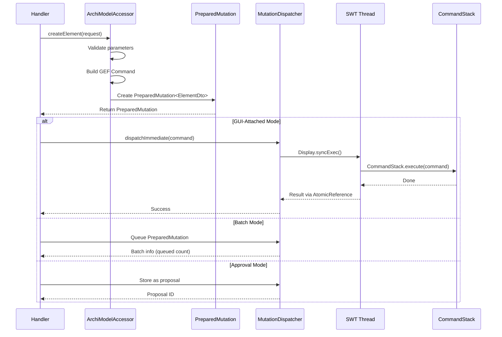
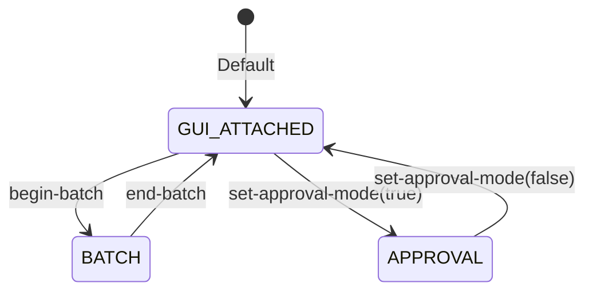

# Mutation Model

This document describes how the ArchiMate MCP Server handles model mutations, including the PreparedMutation pattern, CommandStack integration, operational modes, and the approval workflow.

## Table of Contents

- [Mutation Flow Overview](#mutation-flow-overview)
- [PreparedMutation Pattern](#preparedmutation-pattern)
- [MutationDispatcher](#mutationdispatcher)
- [Operational Modes](#operational-modes)
- [Undo and Redo](#undo-and-redo)
- [Approval Workflow](#approval-workflow)
- [Batch Mode](#batch-mode)
- [Bulk Mutate](#bulk-mutate)
- [Inline Specialization Parameter](#inline-specialization-parameter)
- [Specialization Icons](#specialization-icons)
- [Relationship Semantic Attributes](#relationship-semantic-attributes)
- [Model Metadata Mutation](#model-metadata-mutation)
- [Error Handling](#error-handling)

## Mutation Flow Overview

All model mutations follow a strict path from handler through CommandStack to the EMF model.



**Key invariant:** All mutations go through GEF `CommandStack.execute()` on the SWT UI thread. Direct EMF modification corrupts the model and breaks undo/redo.

## PreparedMutation Pattern

`PreparedMutation<T>` is an immutable record that encapsulates the complete state of a mutation before dispatch. It enables two-phase execution: prepare (validate) first, execute second.

```java
record PreparedMutation<T>(
    Command command,      // GEF Command ready for CommandStack
    T entity,             // DTO representation of the result
    String entityId,      // Unique identifier of created/updated entity
    Object rawObject      // Raw EMF object (for bulk back-references)
)
```

### Two-Phase Execution

- **Phase 1 (Preparation):** The handler calls `ArchiModelAccessor`, which validates parameters, creates the EMF object and GEF Command, and returns a `PreparedMutation<T>` — but does not execute.
- **Phase 2 (Dispatch):** The handler checks the operational mode and either dispatches immediately, queues for batch, or stores as a proposal.

### Why Two Phases

Bulk operations pre-validate **all** mutations before executing **any**. If any operation fails validation, the entire bulk operation is rejected (all-or-nothing). This prevents partial model corruption from mid-batch failures.

### Generic Type Parameter

The type parameter `<T>` constrains to the appropriate DTO type:

- `PreparedMutation<ElementDto>` for element creation
- `PreparedMutation<RelationshipDto>` for relationship creation
- `PreparedMutation<ViewDto>` for view creation
- `PreparedMutation<MutationResultDto>` for updates and deletions

**Source:** `model/PreparedMutation.java`

## MutationDispatcher

The `MutationDispatcher` is the single point where Jetty threads cross to the SWT UI thread.

### Thread Crossing

```java
dispatchImmediate(Command command) {
    Display.syncExec(() -> {
        CommandStack.execute(command);
    });
    // Result passed back via AtomicReference
}
```

### Version Tracking

After each dispatch, `ModelVersionTracker` increments the model version. This invalidates session caches and enables the `_meta.modelChanged` flag in responses.

### Per-Session State

`MutationDispatcher` maintains per-session operational mode and batch state via `ConcurrentHashMap<String, MutationContext>`.

**Source:** `model/MutationDispatcher.java`

## Operational Modes



| Mode | Behavior | Undo Granularity |
|------|----------|------------------|
| **GUI-ATTACHED** | Mutations execute immediately, UI updates in real-time | Each mutation is a separate undo unit |
| **BATCH** | Mutations are queued; committed atomically on `end-batch` | Entire batch is a single undo unit |
| **APPROVAL** | Mutations become proposals; executed only on explicit approval | Each approved mutation is a separate undo unit |

## Undo and Redo

The `CommandStackHandler` exposes Archi's native GEF CommandStack as MCP tools.

### undo

- **Parameters:** `steps` (integer, default 1, minimum 1)
- Pops N commands from the undo stack
- Returns list of undone command labels
- Standard sequential undo (most recent first)

### redo

- **Parameters:** `steps` (integer, default 1, minimum 1)
- Pushes N commands back from the redo stack
- Redo stack is cleared on any new mutation post-undo

### Experimental Workflow

Undo/redo enables speculative layout workflows:

```text
1. auto-layout-and-route (apply layout)
2. assess-layout (check quality)
3. If unsatisfied: undo (revert to previous state)
4. Try different parameters and repeat
```

**Source:** `handlers/CommandStackHandler.java`

## Approval Workflow

The approval workflow provides human-in-the-loop control for experimental or high-risk mutations.

### set-approval-mode

- **Parameters:** `enabled` (boolean, required)
- When enabled: all mutations become proposals (queued, not executed)
- When disabled: mutations apply immediately
- State is per-session

### list-pending-approvals

- Returns all pending proposals for the current session
- Each proposal includes: proposalId, tool name, description, parameters

### decide-mutation

- **Parameters:**
  - `proposalId` (string): `"p-1"`, `"p-2"`, etc., or `"all"` for batch decision
  - `decision` (string): `"approve"` or `"reject"`
  - `reason` (optional string): explanation
- **Single approval:** execute the mutation immediately
- **Single rejection:** discard the mutation
- **Approve all:** process in order, stop on first stale proposal
- **Reject all:** discard all pending
- **Stale proposals:** if the model changed since proposal creation, the proposal cannot be approved (prevents applying outdated mutations to a changed model)

### Workflow Example

```text
1. set-approval-mode(enabled=true)
2. create-element(...)          → returns proposal p-1
3. create-relationship(...)     → returns proposal p-2
4. list-pending-approvals       → shows p-1, p-2
5. decide-mutation(p-1, approve) → element created
6. decide-mutation(p-2, reject)  → relationship discarded
```

**Source:** `handlers/ApprovalHandler.java`

## Batch Mode

Batch mode groups multiple mutations into a single atomic, undoable operation.

### begin-batch

- **Parameters:** `description` (optional string)
- Transitions session from GUI-attached to BATCH mode
- Subsequent mutations are queued, not executed
- Error if batch already active

### end-batch

- **Parameters:** `rollback` (optional boolean, default false)
- **Commit** (`rollback=false`): execute all queued mutations as a single `NonNotifyingCompoundCommand` — one undo unit
- **Rollback** (`rollback=true`): discard all queued mutations, model unchanged

### get-batch-status

- Returns current mode (GUI_ATTACHED or BATCH) and queued count

**Source:** `handlers/MutationHandler.java`

## Bulk Mutate

The `bulk-mutate` tool executes multiple mutations in a single request.

### Parameters

| Parameter | Required | Description |
|-----------|----------|-------------|
| `operations` | Yes | Array of mutation objects |
| `description` | No | Undo history label |
| `continueOnError` | No | `false` = all-or-nothing (default), `true` = partial failure |

### Supported Operations

27 tools are supported in bulk: create, update, view placement (including `add-view-reference-to-view` and `add-image-to-view`), `update-model`, folder, deletion, and specialization tools. Query tools, undo/redo, approval tools, and session tools are not supported. The full list is maintained as `BulkOperation.SUPPORTED_TOOLS_ORDERED` — both the tool description and the operations-array parameter description derive from this single source of truth.

### Back-Reference Syntax

Operations can reference results from earlier operations using `$N.id`:

```json
{
  "operations": [
    {"tool": "create-element", "params": {"type": "ApplicationComponent", "name": "Service A"}},
    {"tool": "create-element", "params": {"type": "ApplicationComponent", "name": "Service B"}},
    {"tool": "create-relationship", "params": {
      "type": "ServingRelationship",
      "sourceId": "$0.id",
      "targetId": "$1.id"
    }}
  ]
}
```

Back-references are **0-indexed**: `$0.id` is the result of the first operation. A reference may only point *backward* — to an operation that has already produced a result.

**Reference validation** distinguishes two failure modes with separate, actionable messages:

- **Self-reference** — `$N.id` inside operation N. A create tool cannot reference its own not-yet-created result. When a previous operation exists, the error includes a `Did you mean $(N-1).id?` suggestion.
- **Forward-reference** — `$N.id` where N is a *later* operation. The referenced result does not exist yet.

Both reject with `INVALID_PARAMETER`; the distinct diagnostics let a caller tell an operator off-by-one apart from a forward-reference mistake on the first response.

### Failure Semantics

**All-or-nothing** (`continueOnError=false`, default):
- Pre-validate all operations before executing any
- First failure rejects the entire bulk operation
- No model changes if any operation fails

**Partial failure** (`continueOnError=true`):
- Execute all valid operations, report failures
- Failed operations invalidate dependent back-references (cascading failures)
- Response includes both `succeeded` and `failed` arrays

### Maximum Operations

150 per `bulk-mutate` call.

### Bulk Profile Deduplication Cache

When a `bulk-mutate` batch creates multiple elements or relationships with the same new specialization, a `ThreadLocal<Map<String, IProfile>>` bulk profile cache prevents duplicate specialization profiles from being created. The problem arises because bulk-mutate runs all prepare methods before dispatching any commands — so `resolveOrCreateProfile` cannot find profiles created by earlier (not yet executed) operations in the same batch.

The cache is scoped to a single `executeBulk` call:

1. **Set** before phase 1 (prepare) begins
2. **Consulted** by `resolveOrCreateProfile` before the model lookup — on cache hit, the existing profile is reused
3. **Populated** on both miss-paths (new profile created, or existing model profile found)
4. **Managed** by specialization mutation prepares: `prepareCreateSpecialization` publishes new profiles, `prepareUpdateSpecialization` re-keys on rename, `prepareDeleteSpecialization` evicts
5. **Cleared** in `finally` after all commands dispatch

Single-call (non-bulk) paths see a `null` cache reference and behave exactly as before. The cache key is `lowercase(name) + "|" + conceptType` for case-insensitive deduplication.

### Integration with Other Modes

- **Approval mode:** wraps entire bulk result in a proposal
- **Batch mode:** queues the compound operation
- **GUI-attached:** executes immediately as a single undo unit

**Source:** `handlers/MutationHandler.java`

## Inline Specialization Parameter

`create-element`, `create-relationship`, `update-element`, and `update-relationship` accept an optional `specialization` parameter that ties the concept to an ArchiMate specialization (an IS-A subtype like "Microservice" or "Cloud Server"). The parameter integrates with the standard mutation pipeline — no separate command stack invocation is required.

### Auto-Create on First Use

On `create-element` and `create-relationship`, if the named specialization does not yet exist for the concept's type, the server creates it and applies it to the new concept in a single GEF `CompoundCommand`:

```text
CompoundCommand
  ├── CreateProfileCommand("Microservice", ApplicationComponent)
  └── CreateElementCommand(ApplicationComponent "Order Service")
        └── ApplySpecializationCommand("Microservice")
```

The compound command becomes a single undo unit. Undoing the create removes both the element and the auto-created specialization (if no other concept references it).

### Update Semantics

On `update-element` and `update-relationship`:

| `specialization` value | Behavior |
|---|---|
| omitted | Specialization is unchanged |
| `"Microservice"` | Replace the primary specialization. Auto-creates the specialization if missing |
| `""` (empty string) | Clear all specializations on the concept |

The clear semantics use `ClearSpecializationCommand`. The reassign path uses `ApplySpecializationCommand`, which detaches the previous primary before attaching the new one.

### Identity and Type Binding

A specialization is identified by `(name, conceptType)` — the same name on a different concept type is a different specialization. The accessor enforces:

- Case-insensitive name matching against existing specializations
- Concept-type binding to the concrete EClass of the mutation target (e.g. `Node`, not `ArchimateConcept`)
- Rejection of abstract bases (`ArchimateConcept`, `ArchimateElement`, `ArchimateRelationship`)

### Bulk-Mutate Pre-Registration Pattern

`create-specialization` is supported in `bulk-mutate`, enabling vocabulary pre-registration in a single atomic batch:

```json
{
  "operations": [
    {"tool": "create-specialization", "params": {"name": "Microservice", "conceptType": "ApplicationComponent"}},
    {"tool": "create-specialization", "params": {"name": "API Gateway", "conceptType": "ApplicationComponent"}},
    {"tool": "create-element", "params": {"type": "ApplicationComponent", "name": "Order Service", "specialization": "Microservice"}},
    {"tool": "create-element", "params": {"type": "ApplicationComponent", "name": "Public API Edge", "specialization": "API Gateway"}}
  ]
}
```

`create-specialization` is idempotent — re-running the same `(name, conceptType)` returns the existing specialization rather than failing. This makes pre-registration safe to retry across sessions.

### Multi-Profile Caveat

A concept can technically carry more than one specialization in the underlying EMF model, but the inline `specialization` parameter reads and writes only the **primary** (first) specialization. The `specialization` field on `ElementDto` and `RelationshipDto` exposes the same primary value. For multi-faceted classification, prefer multiple specializations on different relationships, or use properties.

**Source:** `model/CreateProfileCommand.java`, `model/UpdateProfileCommand.java`, `model/DeleteProfileCommand.java`, `model/ApplySpecializationCommand.java`, `model/ClearSpecializationCommand.java`, `handlers/SpecializationHandler.java`

## Specialization Icons

`create-specialization` and `update-specialization` accept an optional `imagePath` parameter that ties an image stored in the model's archive to the specialization. Archi renders the named image as the specialization's icon on every element or relationship of that specialization.

| Tool | Parameter | Semantics |
|------|-----------|-----------|
| `create-specialization` | `imagePath` (optional) | Set the icon at definition time. Idempotent re-creation by `(name, conceptType)` returns the existing specialization unchanged (no icon swap on duplicate) |
| `update-specialization` | `imagePath` (optional) | Set or change the icon on an existing specialization |
| `update-specialization` | `clearImagePath: true` (optional) | Explicitly clear the icon. Mutually exclusive with `imagePath` |

`update-specialization` relaxed `newName` from required to optional in v1.5 — at least one of `newName`, `imagePath`, or `clearImagePath` must be supplied. Supplying `imagePath` and `clearImagePath` together is rejected with `INVALID_PARAMETER`.

The `imagePath` value is the archive path returned by `add-image-to-model` (e.g. `images/<sha1>.png`) or surfaced by `list-model-images`. A typo'd path is rejected with `IMAGE_NOT_FOUND` — a deliberate deviation from the validation-sync principle, since Archi's GUI silently renders a broken-image placeholder rather than surfacing the failure.

Under the hood, `UpdateProfileCommand` snapshots `oldName` and `oldImagePath` on execute and restores both on undo. The image-path apply is idempotence-guarded (same-value sets are no-ops) to avoid spurious model-dirty notifications.

`list-specializations` returns each specialization's `imagePath` field (omitted when no icon is set), so an agent can audit the icon vocabulary without a separate call.

**Source:** `model/UpdateProfileCommand.java`, `handlers/SpecializationHandler.java`

## Relationship Semantic Attributes

`create-relationship` and `update-relationship` accept three additive, type-conditional optional parameters for ArchiMate's relationship-subtype semantics. Each applies only to one relationship subtype; supplying a parameter on the wrong subtype is rejected at the prepare boundary with `INVALID_PARAMETER` and a `suggestedCorrection` naming the valid type.

| Parameter | Applies To | Type | Semantics |
|-----------|-----------|------|-----------|
| `accessType` | `AccessRelationship` | enum (`"access"` / `"read"` / `"write"` / `"readwrite"`) | `"access"` is unspecified (the default). The enum is closed; empty-string `accessType` is rejected — use `"access"` to set back to unspecified |
| `associationDirected` | `AssociationRelationship` | boolean | `true` renders an arrowhead; `false` (default) renders an undirected line |
| `influenceStrength` | `InfluenceRelationship` | string (max 255 chars) | Free text qualifier (e.g. `"+"`, `"++"`, `"-"`, `"--"`, or any convention you prefer). Empty string clears the field |

`RelationshipDto` carries the three fields under `@JsonInclude(NON_NULL)` — they populate only when the relationship is the matching subtype, so JSON shapes for relationships of any other type are unchanged. Every read surface (`get-relationships`, `search-relationships`, `get-view-contents`, `find-concept-usage`) inherits the fields automatically through the single DTO conversion path.

`UpdateRelationshipCommand` snapshots the previous values of all three fields on execute and restores them on undo for full Cmd+Z fidelity. The apply path is idempotence-guarded to avoid spurious change notifications when a value matches the existing one.

**Source:** `model/UpdateRelationshipCommand.java`, `response/dto/RelationshipSemanticAttributes.java`, `response/dto/RelationshipDto.java`, `handlers/ElementCreationHandler.java`, `handlers/ElementUpdateHandler.java`

## Model Metadata Mutation

`update-model` is the write counterpart to `get-model-info` — it sets the loaded model's own `name`, `purpose`, and custom `properties` as a single undo unit. The shape mirrors `update-view`.

| Parameter | Required | Semantics |
|-----------|----------|-----------|
| `name` | Optional | New display name. Empty string is rejected (provide a non-empty name or omit the parameter) |
| `purpose` | Optional | New free-text description. Empty string clears the field |
| `properties` | Optional | Object of key→value pairs; `null` value removes a key. Omit the parameter entirely to leave properties unchanged |

At least one of the three must be provided; omitted parameters stay unchanged.

`IArchimateModel` in Archi 5.7/5.8 does not extend `IDocumentable` — there is no separate model-level `documentation` field. `purpose` IS the model-level free-text field Archi exposes.

`get-model-info` gained read-side parity for the same fields: its response now carries `purpose` and `properties` alongside the existing counts and distributions. Default-state models (no purpose, no properties) see byte-identical responses because the new fields are omitted under `@JsonInclude(NON_NULL)`.

`bulk-mutate` accepts `update-model`. If a property key appears multiple times on the model, only the first occurrence is updated; the response DTO may report the last value for that key, mirroring `update-view`'s multi-key behaviour.

**Source:** `model/UpdateModelCommand.java`, `response/dto/ModelInfoDto.java`, `handlers/ModelQueryHandler.java`

## Error Handling

### Error Response Structure

```json
{
  "error": {
    "code": "RELATIONSHIP_NOT_ALLOWED",
    "message": "ServingRelationship is not valid between BusinessActor and ApplicationComponent",
    "details": "Archi's validation rules do not permit this relationship type",
    "suggestedCorrection": "Use AccessRelationship instead",
    "archiMateReference": null
  }
}
```

### Common Error Codes

| Code | Meaning |
|------|---------|
| `ELEMENT_NOT_FOUND` | Element/relationship/view not found by ID |
| `RELATIONSHIP_NOT_ALLOWED` | Violates ArchiMate relationship validation |
| `MUTATION_FAILED` | Command execution failed |
| `BATCH_NOT_ACTIVE` | Tried to end batch when not in batch mode |
| `BATCH_ALREADY_ACTIVE` | Tried to begin batch when already in batch |
| `APPROVAL_NOT_ACTIVE` | Tried to decide when not in approval mode |
| `PROPOSAL_STALE` | Model changed since proposal creation |
| `BULK_VALIDATION_FAILED` | Pre-validation failed for bulk operation |
| `INVALID_PARAMETER` | Parameter validation failure |
| `MODEL_NOT_LOADED` | No ArchiMate model open |
| `IMAGE_NOT_FOUND` | Supplied `imagePath` does not resolve to bytes in the model archive (`add-image-to-view`, `create-specialization` / `update-specialization` icon path) |

### Validation Sync Principle

Relationship validation delegates to Archi's own `ArchimateModelUtils.isValidRelationship()`. The MCP server is never stricter nor more forgiving than Archi itself. If Archi allows it, the server allows it. If Archi rejects it, the server rejects it.

---

**See also:** [MCP Integration](mcp-integration.md) | [Architecture Overview](architecture.md) | [Extension Guide](extension-guide.md)
