# Connection Routing Pipeline

This document describes the obstacle-aware orthogonal connection routing system. All routing classes are pure-geometry implementations with no EMF or SWT dependencies.

## Table of Contents

- [Pipeline Overview](#pipeline-overview)
- [Pipeline Invariants](#pipeline-invariants)
- [Best-of-K Seeded Multi-Start](#best-of-k-seeded-multi-start)
- [Visibility Graph Construction](#visibility-graph-construction)
- [A* Path Search](#a-path-search)
- [Path Simplification](#path-simplification)
- [Path Ordering](#path-ordering)
- [Edge Nudging](#edge-nudging)
- [Coincident Segment Detection](#coincident-segment-detection)
- [Channel-Global Ordered Nudging](#channel-global-ordered-nudging)
- [Label Clearance](#label-clearance)
- [Terminal Edge Attachment](#terminal-edge-attachment)
- [Path Cleanup and Validation](#path-cleanup-and-validation)
- [Post-Processing Stages](#post-processing-stages)
- [Label Position Optimization](#label-position-optimization)
- [Endpoint Pass-Through Correction](#endpoint-pass-through-correction)
- [Hub-Perimeter Routing Stage](#hub-perimeter-routing-stage)
- [Terminal-Segment Corridor Migration](#terminal-segment-corridor-migration)
- [Corridor Re-Route](#corridor-re-route)
- [Corridor Diversity](#corridor-diversity)
- [Fallback Edge Port Strategy](#fallback-edge-port-strategy)
- [Auto-Nudge on Route Failure](#auto-nudge-on-route-failure)
- [Recommendation Engine](#recommendation-engine)
- [Data Structures](#data-structures)
- [Configuration Constants](#configuration-constants)
- [References](#references)

## Pipeline Overview

The routing pipeline processes all connections in a view through multiple refinement stages. Each stage builds on the previous result.

```mermaid
flowchart TD
    A["Build Visibility Graph\n(perimeterMargin=50px)"] --> B["A* Path Search\n(per connection)\n+clearanceCost"]
    B --> C["Path Simplification"]
    C --> D["Path Ordering Analysis"]
    D --> E["Edge Nudging"]
    E --> F["Coincident Segment Detection\n(proportional corridor spacing)"]
    F --> G["Label Clearance"]
    G --> H["Endpoint Trimming"]
    H --> I["Obstacle Re-Validation"]
    I --> J["Orthogonal Enforcement"]
    J --> K["Terminal Edge Attachment\n(Phases 1.1-1.3, 2, 3)"]
    K --> L["Path Cleanup"]
    L --> L2["Endpoint Pass-Through\nCorrection"]
    L2 --> L3["Stage 4.7f: Self-Element\nPass-Through Safety Net"]
    L3 --> L4["Stage 4.7g: Path\nSimplification (late)"]
    L4 --> L5["Stage 4.7h: Coincident\nSegment Resolution"]
    L5 --> L6["Stage 4.7i: Path\nStraightening"]
    L6 --> L7["Stage 4.7k: Center-\nTermination Fix"]
    L7 --> L8["Stage 4.7m: Interior\nTerminal BP Fix"]
    L8 --> L9["Stage 4.7n: Orthogonality\nEnforcement"]
    L9 --> L9o["Stage 4.7o: Channel-Global\nOrdered Nudging (B69-B)"]
    L9o --> L9p["Stage 4.7p: Source/Target\nSelf-Hug Correction (B72-a)"]
    L9p --> L9q["Stage 4.7q: Terminal-Anchored\nCoincident Reconciliation"]
    L9q --> M["Label Position Optimization"]
    M --> N["Final Validation"]
    N --> O{"All routes\nvalid?"}
    O -->|Yes| P["Return RoutingResult\n(routed)"]
    O -->|No| N2["Stage 5a: Corridor\nRe-Route"]
    N2 --> Q{"Fallback Edge\nPorts Available?"}
    Q -->|Yes| B2["Re-route with\nAlternative Ports"]
    B2 --> N
    Q -->|No| R["Recommendation Engine"]
    R --> S{"autoNudge\nenabled?"}
    S -->|Yes| T["Apply Nudges\n& Re-route"]
    T --> P
    S -->|No| P
```



**Key principles:**

- All paths are orthogonal (horizontal and vertical segments only)
- Obstacles are expanded by a clearance margin (10px default)
- Perimeter boundary nodes extend beyond obstacles by a separate perimeter margin (50px default) for exterior routing
- Later stages never undo earlier work
- Failed connections include move recommendations for blocking elements
- The whole pipeline runs inside a never-worse-by-construction best-of-K wrapper — see [Best-of-K Seeded Multi-Start](#best-of-k-seeded-multi-start)

**Source:** `model/routing/RoutingPipeline.java`

## Pipeline Invariants

### Perimeter-Terminal Immutability (B71)

Once `EdgeAttachmentCalculator` selects a terminal face for a connection, that face is immutable across all subsequent post-processing stages. The selected face is captured in a `TerminalAnchoring(Face)` record (`model/routing/TerminalAnchoring.java`). When a downstream stage needs to swap the face — for example, a self-hug correction in Stage 4.7p — the swap and its dependent terminal-segment update are applied as a single atomic mutation across the five wrap sites:

1. Path simplification
2. Coincident-segment resolution
3. Path straightening
4. Center-termination fix
5. Interior-BP fix

This prevents the pre-B71 failure mode where a downstream stage moved a terminal away from the face the router had reserved port allocation for, collapsing hub-port distribution and producing fan-in bundles.

The invariant is JUnit-protected by `V4OracleQualityRegressionTest`, which pins:

- `hubPortQualityScore` ≥ 0.70
- `coincidentSegmentCount` ≤ 3
- `nonOrthogonalTerminalCount` ≤ 5

The test source names these constants `HPQ_FLOOR`, `M5_CEILING`, and `M1_CEILING`. The `M5_CEILING` name reflects the constant's release-gate slot, not the M5 hub-port-quality metric (which is bounded separately by `HPQ_FLOOR`). The constant bounds `result.coincidentSegmentCount()` — the legacy parallel-coincident-segment count.

against the V4 manual-routing oracle.

**Source:** `model/routing/TerminalAnchoring.java`, `model/routing/EdgeAttachmentCalculator.java`, `model/routing/RoutingPipeline.java`

## Best-of-K Seeded Multi-Start

`auto-route-connections` wraps the routing pipeline in a **never-worse-by-construction** best-of-K outer loop (`BestOfKRoutingStrategy`, K = 12). The pipeline is run several times from different starting seeds; the candidate with the best aggregate quality is kept.

The "never worse by construction" property holds because the default single-shot seed is always one of the K candidates. The wrapper can only ever return a result at least as good as the un-wrapped pipeline — it never trades a known-good route for a worse exploratory one. Selection uses the same aggregate quality scalar the assessor produces, so the chosen candidate is the one an `assess-layout` call would rate highest.

The wrapper is scoped at the structural level: it is pinned by structural regression tests against the V4 manual oracle and is not, on its own, credited with moving the agent-in-loop visual gate. It is a safety-and-upgrade wrapper, not a new routing algorithm — the per-seed work is the same pipeline documented in the rest of this file.

**Source:** `model/routing/BestOfKRoutingStrategy.java`, `model/routing/RoutingPipeline.java`

## Visibility Graph Construction

The `OrthogonalVisibilityGraph` builds a grid-like graph from obstacle rectangles, following the orthogonal-routing visibility-graph approach in [1], [2], [12].

### Build Process

1. **Obstacle expansion** — expand each obstacle by clearance margin (default 10px) to maintain clearance
2. **Corner collection** — extract 4 corners from each expanded obstacle (top-left, top-right, bottom-left, bottom-right)
3. **Perimeter boundary nodes** — add 4 corner nodes beyond all obstacles by `perimeterMargin` (default 50px). This larger perimeter enables exterior routing — connections can travel around the outside of element clusters rather than being forced through congested interior corridors
4. **Interior pruning** — remove corner nodes that fall inside other expanded obstacles
5. **Scan line projection** — collect all unique x-coordinates and y-coordinates from corner nodes, create `SCAN_INTERSECTION` nodes at grid points not inside obstacles
6. **Edge building** — connect adjacent nodes on the same horizontal or vertical scan line if the segment is not blocked by obstacles

### Segment Blocking (Strict Mode)

A segment is blocked if it passes **strictly between** an obstacle's expanded boundaries (not touching them). Segments touching boundaries pass through freely.

This strict mode is essential — inclusive blocking breaks graph connectivity for corner nodes on obstacle boundaries.

### Port Node Injection

For each connection's source and target, the graph injects PORT nodes at element centers:

1. Check if a node already exists at `(x, y)`
2. If not, create a new PORT node
3. Connect to the graph by finding the nearest visible node in each cardinal direction (UP, DOWN, LEFT, RIGHT)

### Congestion Density

`computeEdgeDensity(from, to)` counts obstacles within a 60px radius of the edge midpoint. This density value feeds into congestion-aware A* cost calculation.

### Perpendicular Clearance

`computePerpendicularClearance(from, to)` measures the distance from a graph edge to the nearest obstacle boundary in the perpendicular direction:

- **Horizontal edges:** measures vertical distance from edge Y to nearest obstacle top/bottom boundary (only for obstacles whose X-range overlaps the edge's X-span)
- **Vertical edges:** measures horizontal distance from edge X to nearest obstacle left/right boundary (only for obstacles whose Y-range overlaps the edge's Y-span)
- Returns `Double.MAX_VALUE` if no nearby obstacles
- Returns `0` if the edge is inside an obstacle

This clearance value feeds into the A* clearance cost (capped at `MAX_EFFECTIVE_CLEARANCE` of 60px), steering the router toward edges with more open space without over-weighting very wide corridors.

**Source:** `model/routing/OrthogonalVisibilityGraph.java`

## A* Path Search

The `VisibilityGraphRouter` performs A* search [6] with **direction-aware state space** to minimize unnecessary bends [1], [12].

### Search State

```text
State = (VisNode, entryDirection)
entryDirection in {UP, DOWN, LEFT, RIGHT, null}
```

Two arrivals at the same node from different directions are distinct states, allowing the search to explore different bend configurations.

### Cost Function

```text
f(state) = g(state) + h(state)

g = edgeCost + bendCost + directionCost + congestionCost + clearanceCost
    + directionalityCost + groupWallClearanceCost

  edgeCost              = effectiveDistance to neighbor
                          effectiveDistance = distance * (1 + occupancyWeight * occupancy)
                          where occupancy = number of prior paths using this corridor (B47)
  bendCost              = bendPenalty (30px) if direction changes, 0 if same direction
  directionCost         = DIRECTION_PENALTY (15px) if moving away from target on dominant axis
  congestionCost        = congestionWeight (5.0) * edgeDensity (if density >= 2)
  clearanceCost         = clearanceWeight (75.0) / max(min(clearance, MAX_EFFECTIVE_CLEARANCE), 1.0)
                          (only when clearanceWeight > 0 and clearance < MAX_VALUE)
  directionalityCost    = directionalityWeight (30.0) * (1 - cos(angle)) / 2
                          where angle = angle between edge direction and vector to target
  groupWallClearanceCost = clearanceWeight (75.0) / max(min(groupWallClearance, MAX_EFFECTIVE_CLEARANCE), 1.0)
                          (only when clearanceWeight > 0 and group boundaries exist)

h = Manhattan distance to target (admissible heuristic)
```

**Bend penalty tuning:** Higher values produce fewer bends with longer paths [1]. Lower values produce shorter paths with more bends. The default of 30px balances both.

**Clearance cost tuning** (project-specific contribution — libavoid notably does not use inverse-distance clearance): The clearance cost is inversely proportional to perpendicular clearance — edges running close to obstacles are penalized more heavily. The `MAX_EFFECTIVE_CLEARANCE` cap (60px) prevents exterior corridors with unlimited space from becoming artificially attractive ("perimeter suction"). At weight 75.0, an edge with 1px clearance adds 75px equivalent cost, while an edge with 60px+ clearance adds only 1.25px. This steers paths toward open corridors without overriding bend and distance costs. The clearance cost has no effect on edges far from any obstacle (`clearance = MAX_VALUE`).

**Directionality cost tuning:** The cosine-based penalty steers edges toward the target using a continuous gradient. An edge moving directly toward the target adds 0 cost; perpendicular movement adds `directionalityWeight/2` (15px); movement directly away adds the full `directionalityWeight` (30px). This reduces non-orthogonal terminal segments by encouraging direct approach paths rather than circuitous routes around the perimeter.

**Group-wall clearance cost:** Penalizes edges running close to group boundaries, steering the router toward inter-group gaps (corridor centers) rather than inside-group-wall corridors. Uses the same clearance formula and `MAX_EFFECTIVE_CLEARANCE` cap as obstacle clearance. Only active when group boundaries are provided (grouped views). Measures perpendicular distance from each edge to the nearest group top/bottom (for horizontal edges) or left/right boundary (for vertical edges).

**Source:** `model/routing/VisibilityGraphRouter.java`

## Path Simplification

After A* produces a path, greedy simplification removes unnecessary waypoints that result from grid traversal.

**Algorithm:**

1. From the current position, find the farthest reachable point
2. Test three strategies: straight line, horizontal-first L-turn, vertical-first L-turn
3. If endpoints differ in both x and y, insert an L-turn midpoint
4. Advance to the farthest reachable point and repeat

This eliminates staircase patterns common in grid-based pathfinding.

## Path Ordering

The `PathOrderer` analyzes parallel segments from different connections to detect unnecessary crossings [1], [5].

### Segment Extraction

Only intermediate segments are extracted (not terminal segments connecting to source/target). This preserves which face connections enter/exit elements.

### Grouping

Segments are grouped by orientation and shared coordinate:
- `"H:150"` — horizontal segments at y=150 (within 2px tolerance)
- `"V:200"` — vertical segments at x=200 (within 2px tolerance)

### Crossing Detection

For each corridor group, the orderer compares:
- **Perpendicular order** — y-midpoint of connection endpoints (for horizontal corridors)
- **Parallel order** — x-midpoint of segments

If perpendicular order disagrees with parallel order, the crossing is topologically unnecessary.

**Source:** `model/routing/PathOrderer.java`

## Edge Nudging

The `EdgeNudger` separates overlapping parallel segments by distributing them across available corridor space [1], [4].

### Corridor Bounds

For each segment group sharing a coordinate:

1. Compute the union of parallel ranges (x-ranges for horizontal segments)
2. Scan obstacles to find nearest boundaries above and below (for horizontal corridors)
3. Apply obstacle margin to prevent nudging into expanded zones
4. Result: `(lowerBound, upperBound)` defining available corridor width

If an obstacle straddles the corridor (entirely blocks it), nudging is skipped for that group.

### Distribution

1. Sort segments by perpendicular endpoint position (crossing-consistent order)
2. Compute spacing: `min(maxSpacing, max(minSpacing, corridorWidth / (count + 1)))`
3. Center the group: `startOffset = sharedCoord - (spacing * (count - 1)) / 2`
4. Assign new coordinates: `newCoord[i] = startOffset + i * spacing`
5. Clamp to corridor bounds

**Source:** `model/routing/EdgeNudger.java`

## Coincident Segment Detection

After edge nudging, the `CoincidentSegmentDetector` identifies segments from different connections that share identical coordinates and separates them using proportional corridor spacing.

### Criteria

Two segments are coincident if:
- Same orientation (horizontal or vertical)
- Same shared coordinate (within 2px tolerance)
- Overlapping parallel ranges (minimum 5px overlap)

### Offset Application (Three-Pass Architecture)

**First pass — Corridor collection:** Groups segments by orientation and shared coordinate using tolerance-aware grouping. Key format: `"H:<coordinate>"` or `"V:<coordinate>"`.

**Second pass — Gap computation:** For each corridor group (2+ segments), `computeCorridorGap()` scans obstacles to find the nearest boundary on each perpendicular side of the shared coordinate, within the overlap range. Returns `[nearBound, farBound]` defining available perpendicular space. Defaults to `MAX_UNBOUNDED_EXTENT` (100px) when no bounding obstacle exists.

**Third pass — Offset application:** Tries proportional spacing first, falls back to fixed-delta if the corridor is too narrow.

**Proportional mode** (`computeProportionalOffsets()`): distributes N segments evenly across the corridor gap, following the channel-centring scheme in [4] simplified to a closed-form division:

```text
position[i] = gapStart + gapWidth * (i + 1) / (N + 1)
```

Returns `null` if the resulting spacing would be less than `MIN_SEPARATION` (8px), triggering the fixed-delta fallback.

**Fixed-delta fallback** (`applyFixedDeltaOffsets()`): original stacking behavior. First segment anchors in place; remaining segments offset by `offsetDelta * ordinal` (10px default). Tries positive direction first, then negative if blocked by obstacles.

### Perimeter-Terminal Preservation (B70)

Coincident detection skips segments whose endpoints are perimeter terminals — i.e. terminal bendpoints anchored by `TerminalAnchoring(Face)` on a hub element. The same guard is applied in the `collapseBends` post-pass. Without this guard, redistributing two perimeter-terminal segments to separate corridors collapses B9 hub-port distribution back into a single bundled attachment, undoing the work of Phase 1.1 and Stage 4.7m. The guard preserves hub-port quality through the full pipeline at the cost of leaving a small number of intentional perimeter-anchored coincidences for downstream channel nudging to address.

**Source:** `model/routing/CoincidentSegmentDetector.java`

## Channel-Global Ordered Nudging

### B69-B / Stage 4.7o

`ChannelNudgingPass` is a global post-pass that runs after coincident-segment detection and before the post-processing stages, redistributing parallel segment runs across obstacle-bounded corridors. It implements the channel-centring + ordered-nudging pattern from [4] and the channel-grouping primitive from libavoid's `performUnifyingNudgingPreprocessingStep` ([12]).

**Channel keying.** Where the previous corridor-occupancy work (B47) reused `(axis, sharedCoord)` keys, `ChannelKey` is `(axis, gapLow, gapHigh)` — the perpendicular obstacle-bounded gap that contains the segment run. Two parallel runs at the same shared coordinate but in different inter-obstacle gaps are now distinct channels and nudged independently. This eliminated the regression where a single key collected runs from both sides of a separating obstacle.

```text
ChannelKey(axis, gapLow, gapHigh)

axis     = HORIZONTAL | VERTICAL
gapLow   = nearest obstacle boundary on the perpendicular-low side
gapHigh  = nearest obstacle boundary on the perpendicular-high side
```

**Algorithm.**

1. Group segment runs by `ChannelKey`.
2. For each channel, sort runs by perpendicular endpoint (crossing-consistent order).
3. Compute per-channel midpoint `(gapLow + gapHigh) / 2` and available width `gapHigh − gapLow − 2·MIN_CLEARANCE_PX`.
4. Distribute runs across the available width, preserving `MIN_CLEARANCE_PX` on each side.
5. Two runs with the same `ChannelKey` but non-overlapping parallel ranges do **not** receive the same track — they are nudged independently.

**Toggle.** The `enableChannelNudging` parameter on `auto-route-connections` defaults to `true`. Setting `false` disables Stage 4.7o entirely (used for diagnostic comparison runs).

**Diagnostic.** Setting `-Darchi.mcp.b69b.diagnostic=true` enables verbose channel-by-channel logging via `ChannelNudgingPass.DIAGNOSTIC_PROPERTY`.

**Source:** `model/routing/ChannelNudgingPass.java`, `model/routing/RoutingPipeline.java`

## Label Clearance

For connections with non-empty labels, the pipeline checks whether the estimated label rectangle overlaps any obstacle.

### Label Rectangle Estimation

- Character width: 7px, height: 14px
- Padding: 10px horizontal, 6px vertical
- Label width: `text.length() * 7 + 10`
- Label height: `14 + 6 = 20px`

### Position Along Path

- `textPosition 0`: 15% from source (near source)
- `textPosition 1`: 50% along path (middle)
- `textPosition 2`: 85% from source (near target)

The position is computed by walking path segments, accumulating distance, and interpolating at the target fraction.

### Clearance Action

If the label overlaps an obstacle, the pipeline finds the nearest segment and shifts it perpendicular by label height + margin. After shifting, the path is cleaned up (micro-jog removal, dedup, collinear removal).

**Source:** `model/routing/LabelClearance.java`

## Terminal Edge Attachment

The `EdgeAttachmentCalculator` computes terminal bendpoints where connections attach to element perimeters. Processing runs in multiple phases.

### Phase 1.1: Hub Face Redistribution

For hub elements (>= 6 connections), `redistributeHubFaces()` checks face load balance. If a single face carries more than 60% of connections, excess connections are redistributed to adjacent faces. The Kandinsky orthogonal layout model [8] is the background reference for handling vertices of degree > 4; the redistribution policy itself is a project contribution.

### Phase 1.2: Natural Approach Direction

`correctApproachDirection()` adjusts face selection for nearly-aligned elements where the dominant axis is more than 1.2x the minor axis. For vertical alignment, source exits BOTTOM and target enters TOP (or vice versa). For horizontal alignment, uses LEFT/RIGHT. Hub elements are excluded to preserve distributed port allocation.

### Phase 1.3: Pass-Through-Aware Face Selection

`validateFacesForSelfPassThrough()` builds trial paths using current face assignments and checks whether each path clips through its own source or target element (using a 5px inset). When a pass-through is detected, `findCleanAlternativeFace()` tries alternative faces in angular proximity order until a clean path is found.

This phase must run after Phases 1.1 and 1.2 (which set initial face assignments) and before distributed attachment point calculation.

### Face Determination

Compare the direction from element center to the nearest bendpoint:
- `|dx| > |dy|` — horizontal approach (LEFT or RIGHT based on sign)
- `|dy| >= |dx|` — vertical approach (TOP or BOTTOM based on sign)

### Distributed Attachment Points

When multiple connections attach to the same face of an element:

1. Build unified face groups (combining inbound and outbound connections per element face)
2. Sort by perpendicular approach coordinate
3. Distribute attachment points evenly across the face with 15px corner margin
4. If face is too narrow: center with 8px minimum spacing

### Capacity-Aware Port Distribution (B73)

Hub elements that have not been resized to fit their connection count produce a face slot count below the connection count. Pre-B73, the calculator collapsed all over-capacity connections to a single attachment point; the routing pipeline subsequently received a degenerate fan-in geometry and could not recover hub-port distribution.

In v1.4, when face slot count is below connection count, the calculator distributes attachment points proportionally across the available face length using the same crossing-consistent order as the standard distribution path. The user is still encouraged to resize the hub (see [Hub Element Detection in the Layout Engine doc](layout-engine.md#hub-element-detection)) — the proportional distribution is a fallback that prevents the worst-case visual regression rather than a substitute for sufficient face capacity.

A 12px visual-distinguishability floor applies: if proportional distribution would produce sub-12px spacing between adjacent ports, multiple connections collapse into shared slots in a controlled way rather than overflowing the face. The threshold reflects the empirical minimum perceptible separation between distinct line-anchor points on a rendered diagram.

### Perpendicular Enforcement

After placing terminal bendpoints, the calculator ensures the terminal segment is perpendicular to the element face:

- TOP/BOTTOM: `terminal.x` must equal `adjacent.x`
- LEFT/RIGHT: `terminal.y` must equal `adjacent.y`

If alignment is blocked by obstacles, try alternative offsets at +/-8, -8, 16, -16, 24, -24, 32, -32, 48, -48, 64, -64, 96, -96 pixels.

**Source:** `model/routing/EdgeAttachmentCalculator.java`

## Path Cleanup and Validation

After each major pipeline stage, the following cleanup passes run:

### Micro-Jog Removal

Detects segments shorter than 15px (vertical jogs with `dx==0, dy<=15` and horizontal jogs with `dy==0, dx<=15`). Snaps to the dominant direction's coordinate and propagates along connected segments.

### Deduplication and Collinear Removal

- Remove duplicate consecutive points
- Remove intermediate points on collinear segments (3+ points on the same horizontal or vertical line)

### Obstacle Re-Validation

After any modification (nudging, attachment, cleanup), re-check all segments against obstacle boundaries. Remove bendpoints whose adjacent segments cross obstacles. Iterate until clean (max iterations = path size + 5).

### Orthogonal Enforcement

If any consecutive bendpoint pair forms a diagonal segment, insert an intermediate L-turn point (horizontal-first) to restore orthogonality.

## Post-Processing Stages

After path cleanup and endpoint pass-through correction, four post-processing stages run in sequence per connection. Each stage operates on the cumulative result of all previous stages.

### Stage 4.7f: Self-Element Pass-Through Safety Net

Re-runs `correctSelfElementPassThrough()` for both source and target elements. This catches pass-throughs introduced by edge attachment (Stage 4) that were not addressed by the initial endpoint correction. While often ineffective for self-element geometry (detours loop back to the source face), it is retained as defense-in-depth.

> **Rating note (B54):** Self-element pass-throughs that survive this safety net are reported by `assess-layout` for visibility but **excluded from the overall rating**. Cross-element pass-throughs continue to penalise the rating as before. See [Layout Engine — Pass-Throughs](layout-engine.md#pass-throughs).

### Stage 4.7g: Late-Stage Path Simplification

`simplifyFinalPath()` performs greedy shortcutting after all post-processing. The algorithm:

1. From the current position, find the farthest reachable point
2. Test three strategies: straight line, horizontal-first L-turn, vertical-first L-turn
3. Advance to the farthest reachable point and repeat

Terminal bendpoints (first and last) are preserved as chain anchors. Requires at least 4 bendpoints. After simplification, runs deduplication and collinear point removal.

This stage eliminates unnecessary bends introduced by edge nudging, coincident detection, and terminal attachment.

### Stage 4.7h: Post-Simplification Coincident Resolution

Reuses `CoincidentSegmentDetector.detect()` and `applyOffsets()` to catch coincident segments introduced by all preceding post-processing stages (approach direction correction, face selection, path simplification). The proportional-spacing fallback follows [4]. After resolution, runs deduplication and collinear cleanup.

### Stage 4.7i: Path Straightening

The `PathStraightener` applies four correction passes in order:

1. **Snap-to-straight** — For each interior point, checks alignment with predecessor then successor. Snaps if delta in one axis is within threshold (default 20px) and smaller than delta in the other axis. Only snaps to successor when it straightens a kink, not an L-turn corner. Validates snapped segments are obstacle-free.

2. **Direction reversal elimination** — Iteratively finds the largest reversal (outermost pair of segments with opposite directions on the same axis). If start and end are collinear, collapses directly. Otherwise, tries L-turn replacement (horizontal-first, then vertical-first). Safety bound: `maxIterations = path.size()`.

   When invoked on the terminal-augmented path (with the prepended/appended terminal anchors — see below), a `protectTerminals` guard confines the collapse to the route *interior*: terminal anchors may remain collapse endpoints but are never themselves removed. This is what lets `auto-route-connections` **self-heal the "exit-then-return" terminal zigzag** — a connection that overshoots past its target's far edge and doubles back to attach. Previously the pass could greedily match the widest reversal and delete a terminal anchor along with the overshoot; the perimeter-terminal-immutability guard ([B71](#perimeter-terminal-immutability-b71)) then rolled the whole straightening pass back, so the overshoot survived until a full re-layout. Confining the collapse to the interior removes the overshoot in place while keeping both terminal attachment points byte-identical. When a foreign element genuinely blocks the straightened corridor, the obstacle check declines the collapse and the route is left untouched.

3. **Staircase jog collapse** — Detects H-V(jog)-H or V-H(jog)-V patterns where the perpendicular step is within threshold. Shifts the first point to align with the fourth point's axis, removing the two intermediate points. Validates that the resulting segments are obstacle-free.

4. **Bend collapse** — Removes collinear intermediate points where three consecutive points share the same X or Y coordinate and the direct connection is obstacle-free. Requires at least 4 points.

Before Stage 4.7i runs, the pipeline temporarily prepends source center and appends target center to detect terminal-involving reversals. After processing, these anchors are stripped.

**Source:** `model/routing/PathStraightener.java`

### Stage 4.7k: Center-Termination Fix

`fixCenterTerminatedPath()` detects bendpoints placed at the exact center coordinates of their source or target element. Archi's ChopboxAnchor draws a ray from the element center to the first/last bendpoint — when a bendpoint is at the center, this ray has zero length, producing a visual "center termination" where the connection appears to start or end at the element's center rather than its edge.

**Algorithm:**

1. Check if the first bendpoint equals the source element's center coordinates
2. If yes, determine the correct exit face toward the second bendpoint using `determineFace()`
3. Replace the center bendpoint with a point 1px outside the edge face midpoint
4. Repeat for the last bendpoint and target element

This stage runs twice: once after edge attachment (primary fix), and once as defense-in-depth after the cleanup loop — post-processing stages can inadvertently shift bendpoints back to center positions.

**Source:** `model/routing/RoutingPipeline.java`

### Stage 4.7m: Interior Terminal BP Fix

`fixInteriorTerminalBPs()` detects and corrects all bendpoints that fall inside their source or target element bounds — a superset of the center-termination problem (Stage 4.7k catches only exact-center matches, while 4.7m catches all interior points including those near boundaries).

**Algorithm:**

1. Check each bendpoint against source and target element bounding boxes
2. **Terminal BPs** (first/last) inside an element: reposition to the appropriate edge face midpoint, 1px outside the element boundary
3. **Intermediate BPs** inside an element: remove entirely
4. After repositioning, check if the modification broke orthogonality (created diagonal segments) and insert L-bend points where needed

This stage includes a defense-in-depth second pass after cleanup to catch regressions.

**Source:** `model/routing/RoutingPipeline.java`

### Stage 4.7n: Orthogonality Enforcement Safety Net

`enforceOrthogonalPaths()` performs a final scan of all routed paths, detecting any remaining diagonal segments (consecutive bendpoints where both dx and dy differ) and inserting horizontal-first L-turn bendpoints to restore orthogonality.

This catches edge cases where cleanup stages (deduplication, collinear removal) remove bendpoints without reinserting the L-bends needed to maintain orthogonal paths.

**Source:** `model/routing/RoutingPipeline.java`

### Stage 4.7p: Source / Target Self-Hug Correction (B72-a)

When a route's first or last interior segment runs along its own source or target element's perimeter on the way to the opposite endpoint, the connection visually overlaps the element edge — distinct from a pass-through but equally hard to read. `correctSourceFaceHug()` and `correctTargetFaceHug()` detect runs colinear with a face line of the source/target rectangle and shift the offending segment outward into the nearest free corridor.

After the correction shifts a segment, the stage re-runs `CoincidentSegmentDetector` to catch coincident segments introduced by the shift (annotated in source as Stage `4.7p+1`).

This is an empirical fix — there is no published algorithm for "perimeter-hugging segments" as a defect class. It is calibrated against the V4 manual-routing oracle.

**Source:** `model/routing/RoutingPipeline.java` (`correctSourceFaceHug`, `correctTargetFaceHug`)

### Stage 4.7q: Terminal-Anchored Coincident Reconciliation

A final reconciliation pass for coincident segments that earlier stages cannot separate because both endpoints are pinned by `TerminalAnchoring(Face)`. Stages 4.7h and 4.7p+1 use the four-argument detector overload that respects perimeter-terminal preservation (B70); Stage 4.7q runs the channel-centring rationale from [4] on the residual to choose the least-bad placement, accepting one offset rather than producing a coincidence.

V4 oracle measurement: legacy `coincidentSegmentCount` 12 → 2 with `hubPortQualityScore` 0.78 preserved. (The legacy metric is the one the regression test bounds via the constant named `M5_CEILING` — distinct from the new M4 `connectionEdgeCoincidenceCount` introduced in the v1.4 assessor redesign.)

**Source:** `model/routing/RoutingPipeline.java`

## Label Position Optimization

After routing completes, the `LabelPositionOptimizer` selects the best label position for each connection.

### Algorithm (Greedy)

1. Collect connections with non-empty labels
2. Sort by path length descending (longest paths first — most flexibility)
3. For each connection, evaluate all 3 positions (source=0, middle=1, target=2):
   - Score = element overlaps (1.0 each) + proximity near-misses (0.5 each)
   - Exclude source, target, ancestors, and descendants from scoring
4. Select position with minimum score
5. Lock the label rectangle (affects future scoring)

**Source:** `model/routing/LabelPositionOptimizer.java`

## Endpoint Pass-Through Correction

After all pipeline stages (simplification, nudging, edge attachment, cleanup), the pipeline runs a final correction pass for connections that pass through their own source or target elements.

### Detection

The `correctEndpointPassThroughs()` method checks each routed connection. Segment-versus-rectangle clipping uses Liang-Barsky [16]:

1. Identifies bendpoints that fall inside the source or target element's bounding box
2. Detects segments that cross through endpoint elements (not just near edges)
3. Skips groups (transparent containers)

### Correction Strategies

When a pass-through is detected:

1. **Remove interior bendpoints** — bendpoints inside the endpoint element are removed
2. **Fix diagonals** — `fixDiagonalsAvoidingElement()` resolves diagonal segments created by bendpoint removal, routing around the element
3. **Insert detours** — `insertDetourAroundElement()` creates corrective L-shaped detours when simple fixes are insufficient

### Routing-Level Re-Route

At the routing level, `routeConnection()` checks if the initial route passes through a source or target element. If detected, it re-routes with the offending element(s) added as obstacles using `calculateEdgePort()` edge ports.

### Self-Element Pass-Through Backstop (B45, v1.4)

Empirical pass-through correction stages (4.7f safety net, 4.7m interior-BP fix) cannot always converge for self-element geometry — detours frequently loop back to the source face. v1.4 introduces an assessment-side backstop: `LayoutQualityAssessor.terminalSegmentOverPenetrates()` (Option α F3) detects the residual cases at measurement time using the unclipped path against the assessment node, regardless of whether the pipeline managed to clear them. Live verification across four model states reports zero self-element pass-throughs after the predicate landed.

The predicate runs in the assessor, not in the routing pipeline. It does not change routes — it surfaces residuals so they show up in `assess-layout` rather than being silently masked.

**Source:** `model/routing/RoutingPipeline.java`, `model/LayoutQualityAssessor.java` (`terminalSegmentOverPenetrates`)

## Hub-Perimeter Routing Stage

`HubPerimeterRoutingStage` routes hub-incident segments along the hub's perimeter so that connections fanning out of a high-degree element spread across its faces instead of bundling onto one attachment region. It is part of the hub-perimeter routing programme that also includes the capacity-aware port distribution (B73) and the perimeter-terminal immutability invariant (B71).

The stage is, by design, scoped to **multi-bendpoint geometry**. On simple L-shaped routes — size-3 paths whose only candidate segments are terminal-incident and therefore outside the stage's partitioner range — the stage is a documented structural no-op: the partitioner loop has an empty range and produces no change. This is intentional, not a defect; such routes are handled by terminal edge attachment and the Stage 4.7 post-processing chain. The stage targets the longer multi-segment routes typical of a hub-and-spoke integration view.

Like the other v1.4 hub-and-spoke work, the stage is scoped at the structural level (pinned against the V4 manual oracle).

**Source:** `model/routing/HubPerimeterRoutingStage.java`, `model/routing/RoutingPipeline.java`

## Terminal-Segment Corridor Migration

`TerminalSegmentCorridorMigrator` (Axis-3 of the hub-perimeter routing programme, "HPRPS Track-A") is a post-routing stage that migrates a connection's terminal segment onto a better-fitting parallel corridor when the terminal-incident segment is the one creating edge coincidence. Earlier corridor work (channel-global ordered nudging, coincident-segment detection) operates on interior segments and deliberately preserves perimeter terminals under the B71 invariant; this stage closes the remaining gap for the terminal segment itself, moving it as a unit so the perimeter anchor is respected.

It reduces terminal-incident `connectionEdgeCoincidenceCount` on multi-bendpoint routes. Scoped at the structural level; it is the v1.4-final-scope portion of the corridor-migration track.

**Source:** `model/routing/TerminalSegmentCorridorMigrator.java`, `model/routing/RoutingPipeline.java`

## Corridor Re-Route

Stage 5a re-routes connections that failed final validation due to element crossings.

### Behavior

For each `FailedConnection` with `constraintViolated == "element_crossing"`:

1. Re-route using fresh A* search on the visibility graph
2. Apply the full pipeline cleanup sequence (path simplification, obstacle re-validation, orthogonal enforcement, terminal edge attachment, endpoint pass-through correction, and all Stage 4.7 post-processing)
3. Validate the re-routed path against all constraints
4. If clean: promote from `failed`/`violatedRoutes` to `routed` map
5. If still failing: preserve in `violatedRoutes` for fallback edge port strategy

This stage catches connections that initially failed due to congestion but can succeed when re-routed after other connections have been processed and moved by nudging or coincident resolution.

**Source:** `model/routing/RoutingPipeline.java`

## Corridor Diversity

The `CorridorOccupancyTracker` enables inter-connection awareness during sequential A* routing. After each connection is routed, its path is recorded. Later connections query corridor occupancy to discover which corridors are already carrying traffic. The multiplicative occupancy penalty is a single-pass simplification of the negotiation-based congestion model in PathFinder [9].

### How It Works

1. **Path recording:** After each connection is routed, `recordPath()` extracts axis-aligned segments and increments a counter for each corridor key
2. **Corridor keying:** Keys use the format `"H:y"` (horizontal corridors at y-coordinate) and `"V:x"` (vertical corridors at x-coordinate), with tolerance-aware grouping (2px tolerance) matching the `CoincidentSegmentDetector` and `PathOrderer` formats
3. **Occupancy query:** During A* search, `getOccupancy(x1, y1, x2, y2)` returns the number of prior paths using the corridor containing the edge
4. **Cost application:** The A* router multiplies edge distance by `(1 + occupancyWeight * occupancy)`, making occupied corridors progressively more expensive

### Effect

With default `occupancyWeight` of 0.75:
- An unoccupied corridor has cost multiplier 1.0 (no penalty)
- A corridor with 1 prior path has multiplier 1.75
- A corridor with 2 prior paths has multiplier 2.5
- A corridor with 4 prior paths has multiplier 4.0

This encourages later connections to explore alternative corridors rather than stacking on top of earlier routes, reducing coincident segments without relying solely on post-processing resolution. The multiplicative (not additive) application ensures that shorter corridors remain preferred when alternatives would add significant distance.

**Source:** `model/routing/CorridorOccupancyTracker.java`, `model/routing/VisibilityGraphRouter.java`

## Fallback Edge Port Strategy

When the primary edge port choice leads to a failed route (e.g., the port points directly into an adjacent obstacle), the router tries alternative edge ports before giving up.

### Fallback Sequence

1. Try the primary edge port (nearest edge to target)
2. If the route fails, try up to 3 alternative source ports with the primary target port
3. Try alternative target ports with the primary source port
4. Try all remaining source+target combinations
5. First clean route is accepted; if all fail, the primary re-route result is preserved (no regression)

### Alternative Port Calculation

`calculateAlternativeEdgePorts()` returns 3 alternative edge ports ordered by angular proximity to the target element. This ensures the most geometrically promising alternatives are tried first.

**Source:** `model/routing/RoutingPipeline.java`

## Auto-Nudge on Route Failure

The `auto-route-connections` tool supports an `autoNudge` parameter that automatically applies move recommendations and re-routes failed connections in a single atomic operation.

### Behavior

When `autoNudge: true` and routing failures exist with move recommendations:

1. Apply move recommendations via position updates
2. Resize parent groups if needed to accommodate moved elements (via the shared `resizeParentGroupIfNeeded` helper)
3. Re-route previously failed connections with updated positions
4. All commands bundled in a single compound command (atomic undo)
5. Up to `MAX_NUDGE_ITERATIONS = 2` iterations

### Guards

- `force: true` takes precedence over `autoNudge` (no point nudging when force-applying all routes)
- `clear` strategy ignores autoNudge (straight lines have no pass-throughs)
- Overlapping sibling elements detected via `OverlapResolver.hasOverlappingElements()` — if sibling overlaps exist, autoNudge is skipped, a `structuredWarnings[]` entry is emitted (see "Structured Warnings" below), and standard failure reporting is used (overlapping geometry creates degenerate routing conditions). Containment overlaps (parent-child nesting, e.g., ApplicationFunction inside ApplicationComponent) are excluded from this check.

### Post-routing Overflow-Detection Pass (B15 Closure)

After the nudge loop completes (or is skipped), a post-pass iterates every visual object on the view and checks whether any child element's position now lies outside its parent group's bounds. For each violation, the pass calls the shared `resizeParentGroupIfNeeded` helper to grow the parent. The pass is gated by `effectiveAutoNudge` (preserves caller intent — non-autoNudge calls do not trigger parent resizes).

The pass shares an extracted `ArchiModelAccessorImpl.childExceedsParentBounds` static predicate with the spacing-tool path (see [Layout Engine — View Spacing Adjustment](layout-engine.md#view-spacing-adjustment)) so the boundary rule is computed in exactly one place. The autoNudge nudge-driven resizes and the post-pass overflow-driven resizes share a single `virtualGroupBounds` + `groupResizeCommands` consolidation map; the consolidated commit appends as one compound command. Pinned by `AutoNudgeGroupBoundsFollowupTest` (15 tests across the boundary predicate, the post-pass regression, the V4 H2 hub-heavy synthetic fixture, and a 2-element minimal cascade).

### Structured Warnings

The response carries a `structuredWarnings: List<StructuredWarningDto>` field in parallel with the free-text `warnings: List<String>` field. Each entry has `{code, message, remediationTool, remediationViolatorIds}` for deterministic LLM iteration.

| Code | Trigger | `remediationTool` | `remediationViolatorIds` |
|------|---------|-------------------|--------------------------|
| `AUTO_NUDGE_SKIPPED_SIBLING_OVERLAP` | `autoNudge: true` but `OverlapResolver.hasOverlappingElements()` returned true | `layout-within-group` | The offending sibling-pair element IDs (call the remediation tool on their shared parent) |

The autoNudge skip is a **hard gate** that the pipeline cannot resolve on its own — re-running `auto-route-connections` without first separating the siblings will reproduce the same skip. LLM agents should call the named `remediationTool` on the parent of `remediationViolatorIds` before re-routing.

### Response

When nudges are applied, the response includes a `nudgedElements` list with viewObjectId, elementName, deltaX, and deltaY for each moved element, plus a `resizedGroups` list for any parent groups that grew in the consolidated commit.

**Source:** `model/ArchiModelAccessorImpl.java`

## Recommendation Engine

When connections fail routing (still crossing obstacles after all pipeline stages), the `RoutingRecommendationEngine` computes element move suggestions.

For each failed connection:
1. Identify which obstacle blocks the route
2. Compute displacement vector to clear the path
3. Check that the suggested move does not collide with other elements
4. Return `MoveRecommendation` with elementId, dx, dy, reason, and connections unblocked

**Source:** `model/routing/RoutingRecommendationEngine.java`

## Data Structures

### RoutingRect

```java
record RoutingRect(int x, int y, int width, int height, String id)
```

Lightweight rectangle in absolute canvas coordinates. Provides `centerX()` and `centerY()` convenience methods. Optional `id` for traceability.

### VisNode

```java
record VisNode(int x, int y, NodeType type)
// NodeType: OBSTACLE_CORNER, PORT, SCAN_INTERSECTION
```

### VisEdge

```java
record VisEdge(VisNode target, double distance, Direction direction)
// Direction: UP, DOWN, LEFT, RIGHT
```

### RoutingResult

```java
record RoutingResult(
    Map<String, List<AbsoluteBendpointDto>> routed,
    List<FailedConnection> failed,
    List<MoveRecommendation> recommendations,
    Map<String, List<AbsoluteBendpointDto>> violatedRoutes,
    int labelsOptimized,
    Map<String, Integer> optimalPositions)
```

- `routed` — connections that passed all validation
- `failed` — connections still crossing obstacles, with constraint details
- `violatedRoutes` — actual bendpoints for failed connections (for force-mode application)
- `recommendations` — move suggestions for blocking elements

### FailedConnection

```java
record FailedConnection(String connectionId, String sourceId,
                        String targetId, String constraintViolated,
                        String crossedElementId)
```

### MoveRecommendation

```java
record MoveRecommendation(String elementId, String elementName,
                          int dx, int dy, String reason,
                          int connectionsUnblocked)
```

### NudgedElementDto

```java
record NudgedElementDto(String viewObjectId, String elementName,
                        int deltaX, int deltaY)
```

Returned in the `AutoRouteResultDto.nudgedElements` list when `autoNudge` is enabled and elements were moved.

## Configuration Constants

### A* Search (VisibilityGraphRouter)

| Constant | Value | Purpose |
|----------|-------|---------|
| `DEFAULT_BEND_PENALTY` | 30px | A* cost per direction change |
| `DIRECTION_PENALTY` | 15px | A* cost for moving away from target |
| `DEFAULT_CONGESTION_WEIGHT` | 5.0 | A* congestion cost multiplier (density >= 2) |
| `DEFAULT_CLEARANCE_WEIGHT` | 75.0 | A* clearance cost multiplier (inversely proportional to perpendicular clearance) |
| `DEFAULT_DIRECTIONALITY_WEIGHT` | 30.0 | A* corridor directionality cost (cosine-based penalty for edges not moving toward target) |
| `DEFAULT_OCCUPANCY_WEIGHT` | 0.75 | A* corridor occupancy cost multiplier — multiplicative penalty for corridors already carrying traffic (B47) |
| `MAX_EFFECTIVE_CLEARANCE` | 60.0px | Clearance cap — prevents exterior corridors from becoming artificially attractive |

### Visibility Graph (OrthogonalVisibilityGraph)

| Constant | Value | Purpose |
|----------|-------|---------|
| `DEFAULT_MARGIN` | 10px | Obstacle clearance distance |
| `DEFAULT_PERIMETER_MARGIN` | 50px | Perimeter boundary extension beyond obstacles for exterior routing |
| `CONGESTION_RADIUS` | 60px | Radius for edge density computation |

### Pipeline (RoutingPipeline)

| Constant | Value | Purpose |
|----------|-------|---------|
| `MICRO_JOG_THRESHOLD` | 15px | Segments shorter than this are removed |
| `DEFAULT_SNAP_THRESHOLD` | 20px | Snap-to-straight threshold for near-aligned segments |
| `MIN_CLEARANCE` | 8px | Minimum bendpoint clearance from obstacles |
| `CROSSING_INFLATION_THRESHOLD` | 1.5 | Crossing count inflation detection multiplier |

### Edge Attachment (EdgeAttachmentCalculator)

| Constant | Value | Purpose |
|----------|-------|---------|
| `DEFAULT_CORNER_MARGIN` | 15px | Minimum gap from element corners for attachment |
| `DEFAULT_MIN_SPACING` | 8px | Minimum spacing between attachment points on narrow faces |
| `DEFAULT_HUB_THRESHOLD` | 6 | Connection count threshold for hub treatment |
| `MAX_FACE_LOAD_RATIO` | 0.60 | Maximum connection ratio per face before redistribution |
| `SELF_ELEMENT_INSET` | 5px | Inset for self-element pass-through detection in Phase 1.3 |
| `REDIRECT_MARGIN` | 12px | Margin for terminal segment re-routing after face swap |
| Approach direction ratio | 1.2x | Dominant-to-minor axis ratio threshold for Phase 1.2 natural approach direction |

### Channel Nudging (ChannelNudgingPass)

| Constant | Value | Purpose |
|----------|-------|---------|
| `enableChannelNudging` (param) | `true` | Toggle for Stage 4.7o (B69-B). False disables channel-global nudging entirely. |
| `MIN_CLEARANCE_PX` | source-defined | Per-side clearance preserved within each `ChannelKey` gap during distribution. |
| `DIAGNOSTIC_PROPERTY` | `archi.mcp.b69b.diagnostic` | System-property toggle for verbose channel-by-channel logging. |

### Coincident Detection (CoincidentSegmentDetector)

| Constant | Value | Purpose |
|----------|-------|---------|
| Segment grouping tolerance | 2px | Parallel segments within 2px share a corridor |
| Coincident offset delta | 10px | Perpendicular offset between coincident segments (fixed-delta mode) |
| Coincident overlap minimum | 5px | Minimum parallel overlap to trigger coincidence |
| `MIN_SEPARATION` | 8px | Minimum spacing in proportional mode (triggers fixed-delta fallback) |
| `MAX_UNBOUNDED_EXTENT` | 100px | Default corridor bound when no bounding obstacle exists |

### Label Sizing

| Constant | Value | Purpose |
|----------|-------|---------|
| Label char width | 7px | Estimated character width for label sizing |
| Label char height | 14px | Estimated character height |
| Label padding | 10px x 6px | Horizontal and vertical label padding |

---

## References

[1]: bibliography.md#ref-1
[2]: bibliography.md#ref-2
[4]: bibliography.md#ref-4
[5]: bibliography.md#ref-5
[6]: bibliography.md#ref-6
[8]: bibliography.md#ref-8
[9]: bibliography.md#ref-9
[12]: bibliography.md#ref-12
[16]: bibliography.md#ref-16

See [Bibliography](bibliography.md) for full citations.

---

**See also:** [Layout Engine](layout-engine.md) | [Coordinate Model](coordinate-model.md) | [Architecture Overview](architecture.md)
